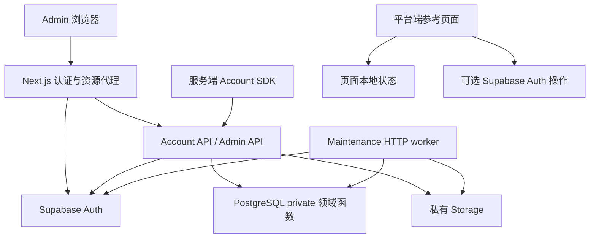

# 系统概览

Aisenhubplatform 为多个自营平台提供共享身份、平台账户、订阅权益、兑换码及配置文件管理。平台账户以 platform_id 隔离，身份由 Supabase Auth 共享。核心业务规则位于 PostgreSQL private 函数，HTTP 层负责认证、输入转换和外部服务调用。

## 组件

| 位置 | 职责 |
| --- | --- |
| apps/admin | Next.js 管理控制台与同源认证、资源代理 |
| apps/template-preview | 账户、配置文件、订阅的本地参考页面 |
| packages/account-auth | Auth 接口、会话和认证意图类型 |
| packages/account-auth-nextjs | Supabase Auth、Cookie、刷新、回调适配 |
| packages/account-server | 服务端 Account API 客户端 |
| packages/domain | DTO、校验、错误及兑换码材料生成 |
| packages/ui、packages/i18n、packages/shared | UI、语言和共享设施 |
| supabase/functions/account-api | Account 与 Admin HTTP 接口 |
| supabase/functions/maintenance | 文件清理、对账、保留清理和身份删除步骤 |
| supabase/migrations | 数据表、角色、授权及事务内领域函数 |
| registry | 本地安装元数据 |

## 调用关系

Admin API 与 Account API 在同一 Edge 源文件中分派，分别切换数据库 executor 角色。管理端资源请求由 Next.js 转发到该服务，管理端本身不直接连接 SQL。

权益和配额写入通过共享数据库过程完成；业务 DTO 与密钥材料工具不承担第二套权益计算。系统没有支付回调、组织／团队服务、微服务消息总线或跨域自动登录服务。

详见[身份与安全](modules/identity-security.md)、[权益](modules/entitlements.md)、[文件任务](modules/files-jobs.md)及[运行拓扑](deployment.md)。
