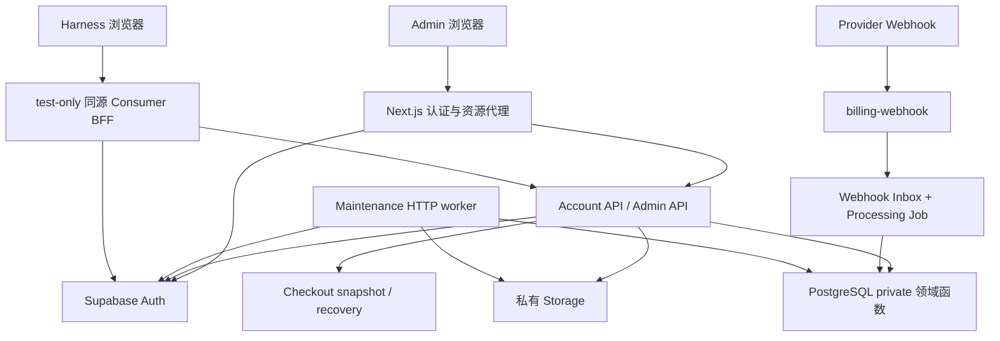

# 系统概览

Aisenhubplatform 为多个自营平台提供共享身份、平台账户、订阅权益、兑换码及配置文件管理。平台账户以 platform_id 隔离，身份由 Supabase Auth 共享。核心业务规则位于 PostgreSQL private 函数，HTTP 层负责认证、输入转换和外部服务调用。

## 组件

| 位置 | 职责 |
| --- | --- |
| apps/admin | Next.js 管理控制台与同源认证、资源代理 |
| tests/consumer-harness | test-only Consumer Conformance Harness；原生 Node 同源 Auth/BFF + 极薄 UI，用于证明公共 HTTP/OpenAPI 接入边界，不参与 workspace/生产部署 |
| apps/admin/app/admin/consumer-lab | 维护者只读 Consumer Lab；build-time 读取 canonical OpenAPI，展示 contract major/version/operations 与 Harness 使用边界，不持有 Consumer Platform Key |
| contracts/account/v1、contracts/admin/v1 | 对 Consumer/Admin 稳定的 canonical OpenAPI 3.1 wire contract、兼容规则与变更记录 |
| packages/domain | 中央内部 DTO、校验、错误、计费/兑换材料及跨运行时工具；不作为 Consumer runtime 依赖发布 |
| packages/ui、packages/i18n、packages/shared | UI、语言和共享设施 |
| supabase/functions/account-api | Account 与 Admin HTTP 接口；`index.ts` 仅组合路由/runtime，认证与共享设施在 `core.ts`，Account/Admin/文件处理分别在独立模块；Global Identity 由 server-only Supabase Auth Admin 读取身份并用 private SQL 聚合平台账户；管理端 BFF 使用显式 method/path allowlist 和上游 deadline |
| supabase/functions/maintenance | 文件清理、对账、保留清理、身份删除和计费任务 lease/fence 步骤；`index.ts` 按 files/identity/billing capability token 鉴权和路由，alerts/files/identity/billing/retention 分模块维护 |
| supabase/functions/billing-webhook | Provider webhook 验签、hash-only Inbox 入站和任务入队 |
| supabase/migrations | 数据表、角色、授权及事务内领域函数 |
| registry | 本地安装元数据 |

## 调用关系

```mermaid
flowchart TD
  Admin[Admin 浏览器] --> Next[Next.js 认证与资源代理]
  Next --> Auth[Supabase Auth]
  Next --> API[Account API / Admin API]
  API --> Auth
  API --> SQL[PostgreSQL private 领域函数]
  API --> Storage[私有 Storage]
  API --> Checkout[Checkout snapshot / recovery]
  Provider[Provider Webhook] --> Webhook[billing-webhook]
  Webhook --> Inbox[Webhook Inbox + Processing Job]
  Inbox --> SQL
  Worker[Maintenance HTTP worker] --> SQL
  Worker --> Storage
  Worker --> Auth
  Harness[Harness 浏览器] --> HarnessBff[test-only 同源 Consumer BFF]
  HarnessBff --> API
  HarnessBff --> Auth
```

Admin API 与 Account API 仍由同一个 Edge Function 入口分派，但实现已按 `core/account/admin/files` 模块拆分；入口根据路径分别切换数据库 executor 角色。管理端资源请求由 Next.js 按 Admin OpenAPI 对齐的显式 method/path allowlist 转发到该服务，并为上游请求设置 deadline，管理端本身不直接连接 SQL。Maintenance 同样保持单一 HTTP 入口与 `job_executor` 边界，按 files/identity/billing capability token 隔离入口，再把 files/identity/billing/retention 等 orchestration 拆到独立模块，不把 PostgreSQL `private` 领域规则搬回 TypeScript。Consumer 集成不依赖 AisenHub runtime SDK 或共享 starter；新平台按 canonical `/v1` HTTP contract 自行拥有 Auth/BFF/integration。`tests/consumer-harness` 只作为可执行协议/安全 conformance fixture，Admin Consumer Lab 只提供合同可视化，两者都不成为目标平台 runtime 依赖。

权益和配额写入通过共享数据库过程完成；业务 DTO 与密钥材料工具不承担第二套权益计算。BILL-04 建立了服务端定价 Checkout snapshot、Provider Order/Settlement 关系、hash-only Webhook Inbox 和可接管的 processing job 基础；BILL-05 增加 Provider-neutral 事实归一化、权威验证/结算、双游标对账与 `entitlement_apply` 统一写入；TASK-0301 的 forward-fix 对 Provider 事实执行显式 fail-closed 校验并保留 unknown 可恢复状态，TASK-0302 让过期 processing 可带新 fence 接管且 query/link/verify/finish/cursor 拒绝失效 lease；BILL-06 增加中央 Billing Admin wrapper、If-Match/operation_id 结案边界、Consumer 同源 BFF 与服务端权益授权辅助。没有 verified Provider mapping 时购买仍关闭，真实 Provider 与生产观察保持独立门槛。系统没有组织／团队服务、微服务消息总线或跨域自动登录服务。

详见[身份与安全](modules/identity-security.md)、[权益](modules/entitlements.md)、[文件任务](modules/files-jobs.md)及[运行拓扑](deployment.md)。
