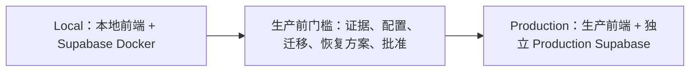

# Agent 开发、分支合并、本地验证与生产发布流程

生效日期：2026-09-14。状态：已接受的工作规则。所有 Agent 开始开发、修复、配置或发布任务前必须阅读；决策依据见 [ADR-0003](../decisions/0003-local-verification-release-gates.md)。规则生效不代表本地环境、部署流水线、测试或告警已经配置完成。

本文件是变更分级、环境流转与发布门槛的唯一规则来源；实际接口和领域规则仍以源码及 [合同](../reference/contracts.md) 为准。用户当前明确指令优先；本文件不授权自动开发后续任务、创建收费资源、发起真实支付或部署生产。

## 1. 环境和发布拓扑



图为标准路线。R0 不部署应用；R1 走本地检查 → 精简生产前门槛 → Production；R2/R3 另加本地 Supabase 验证。CI 是质量检查，不是业务环境。

| 对象 | Local | Production |
| --- | --- | --- |
| Supabase | 本机 Docker；本地数据库、Auth、Storage | 独立 Production 项目 |
| Admin | 本地 Next.js，只接 Local | 生产部署，只接 production |
| 各平台前端/BFF | 本地部署和本地平台凭据 | 生产部署和生产平台凭据 |
| 数据 | 虚构 fixture，可在确认范围后重置 | 真实业务数据 |
| Provider | 默认 Mock；需要时使用隔离沙箱 | 正式业务账号 |
| Worker / Webhook | 模拟与本地进程 | 正式入口、调度及生产数据 |

所有验证默认在 Local 完成；Local/Preview 不连接 Production。远程环境不属于本流程的必需验收。

## 2. Agent 开始任务的必做步骤

1. 阅读根 [AGENTS.md](../../AGENTS.md)、[文档导航](../README.md)、[系统概览](../architecture/overview.md)、[文档规则](../agents.md)和本文件，再读相关模块、reference、任务 proposal 与实际源码。
2. 明确本次 TASK/任务标识、目标、验收标准和授权范围；没有 TASK 编号时用明确任务名，不伪造已有任务。
3. 核对 `git status --short`、分支和 HEAD；记录已有修改、未跟踪迁移/配置及所有权。不打印 Secret，不 reset/checkout/覆盖其他工作；同文件正在被其他工作修改时先协调或报告阻塞。
4. 追踪数据写入口、调用链和消费者，按第 3 节给出 R0/R1/R2/R3 及理由。分类针对候选发布相对于当前生产版本的全部差异，不只看本任务最后一次提交。
5. 列本地测试、本地 Supabase 用例、生产门槛、回退方式和环境缺口。前置未过可继续独立准备，但不能绕过必需门槛。
6. 复用固定工具链；Node、pnpm、Deno、Supabase CLI 的统一基线见 `tooling/toolchain.json`，执行 `pnpm toolchain:check` 核对重复声明与实际 CLI。系统软件安装与缓存按 AGENTS；不因缺工具安装到 C 盘默认位置。

启动说明最少包含：`任务 / 起始HEAD / 已有改动 / 分级及依据 / 受影响消费者 / 本地验证 / 本地 Supabase 验证 / 生产门槛 / 当前授权边界`。

### 2.1 单人、单机的分支规则

只维护一条长期 `main` 和短期 `codex/<任务编号或简短名称>` 任务分支，不要求长期 develop 分支。main是已验收的代码基线，生产运行版本另记准确commit/产物。

1. 默认一次处理一个任务。先检查本地与远端main、分支和工作区；普通新任务从最新已确认main创建任务分支，文档任务也适用。修复只能基于指定发布版本时记录该基线和原因。
2. 已有任务分支且范围一致时继续使用，不反复新建。若工作区含其他任务修改，不直接切分支、暂存所有文件或自动stash；先确认归属，必要时用独立worktree隔离，无法安全隔离则报告阻塞。
3. 每个可独立审阅的步骤形成小提交，只暂存本任务文件。允许推送任务分支备份或触发CI，但先核实该推送不会未经授权触发生产部署。
4. R2/R3在任务分支完成Local和本地 Supabase 验证；R0/R1按第3节规则。单人开发不强制第二人审批，但Agent必须实际审查最终diff及测试证据，不能以自己写的代码为由跳过审查。
5. 满足第2.2节条件后合并main并推送，核对远端SHA；最终版本改变时重验受影响部分。main已有新提交则先集成并验证，不能覆盖远端。禁止force push或绕过分支保护。
6. 推送main与生产部署分别记录。生产部署按G0–G6执行；生产发布完成且分支内容已确认保存在远端main、没有独有提交或未提交工作时，才清理已完成任务分支。不得删除其他任务分支。

### 2.2 自动合并的长期授权与条件

用户已授权Agent为明确派发的任务创建分支、提交和推送，并在全部合并条件满足后自动合并main及推送，无须逐次询问。目标仓库为 `https://github.com/aisenhub/Aisenhubplatform.git`。本授权不包括新增任务、生产部署、真实支付、费用变更或破坏性操作；用户当前更具体的限制优先。

| 级别 | 自动合并main的条件 |
| --- | --- |
| R0 | 文档/注释/独立测试的适用检查、最终diff审查通过；没有改变运行产物或放宽验收 |
| R1 | 本地目标页面、适用质量检查和精简生产门槛通过 |
| R2 | Local、适用CI、本地 Supabase 验证及审查通过；消费者兼容已验证 |
| R3 | R2条件加上适用的领域合同、权限、迁移升级、并发/恢复、Provider 和完整生产门槛证据 |

所有级别还必须满足：

- 核对待合并到main的完整差异；没有无关工作、Secret、未解决冲突或缺失的必需检查。适用且必需的FAIL/NOT_RUN/PARTIAL/BLOCKED均阻止合并。
- 证据对应最终候选及集成结果。main更新或解决冲突后，重跑受影响检查；不能引用另一个代码版本的PASS。纯无语义合并也须确认最终文件树与验收范围一致。
- 已配置的必需CI和分支保护必须满足；无可用CI的替代按第4.2节取得明确授权，不关闭保护或忽略失败。需要PR才能触发现有CI或满足仓库保护时创建PR并等待结果，不额外强制第二个人审批。
- 已确认main的生产自动部署绑定。若合并或推送main会触发生产，必须提前完成G0–G5并有覆盖该版本的生产授权；绑定情况未知时只继续安全准备，不能假定没有自动部署。

没有自动生产部署绑定时，生产Secret、生产备份时效、执行窗口和最终发布批准属于部署门槛，可在代码验收后、生产部署前核验，不必让已验收代码一直留在分支。但迁移可行性、兼容和恢复方案等代码验收证据不能推迟到生产才补。

只有遇到授权范围不足、未决商业规则、文件归属不明、不能安全解决的冲突或要求豁免门槛时才询问用户。测试失败先在已授权范围内排查修复；环境不可用则交付独立准备并报告阻塞。不得通过反复询问“可以合并吗”代替执行已获授权的流程。

## 3. 严格变更分级与允许路线

问题优先级 P0–P3 与发布级别 R0–R3 不同。P2 问题的修复也可能需要 R3 发布。混合变更取最高级；影响不明时至少 R2，涉及资金、身份、隔离或数据时 R3。

| 级别 | 严格允许范围 | 必需本地验证 | 生产前门槛 |
| --- | --- | --- | --- |
| R0：不改变运行产物 | 纯文档、注释；仅测试用例且不进入产物、不改变测试工具链或门槛 | 适用静态检查 | 不部署生产则不适用；若触发站点构建/运行部署，重新分级 |
| R1：基础 | 非业务静态文案、图片、局部颜色/间距，满足下方全部条件 | 本地检查、目标页面验证 | G0–G5 精简检查；发布后 G6 |
| R2：进阶 | 一般功能、共享 UI、构建/依赖/CI 配置等，无 R3 影响 | 本地检查 + 本地 Supabase 验证 + 适用 CI | G0–G5 完整适用项；发布后 G6 |
| R3：核心与安全 | 数据库、Auth、权限、支付、权益、兑换、Storage、业务 API/SDK/BFF、Secret、Worker、恢复等 | R2 本地验证 + 领域合同、权限、并发/恢复和 Provider 验证 | G0–G5 + 领域门槛；发布后 G6 |

R1 必须全部满足：

- 不改数据库、迁移、API、DTO、SDK、BFF、网络请求、依赖、构建或部署配置。
- 不改价格、币种、期限、“永久”、退款、额度、权限或支付/权益状态的含义。
- 不改点击事件、提交、跳转、表单、焦点顺序、键盘行为、遮罩、按钮可用性或敏感信息可见性。
- 不影响共享组件的业务消费者；全局样式、响应式断点、支付/管理操作区域布局按 R2，可能误导资金/授权操作按 R3。
- 已验证目标页面正常且有可用旧产物回退。不能以“只有一行”“只是重构”“只是配置”作为低风险理由。

### 3.1 本项目文件和功能判定表

| 变更 | 示例目录/文件 | 默认级别 | 必需补充 |
| --- | --- | --- | --- |
| 普通说明文档 | docs、README、AGENTS | R0 | 链接、规则一致性；不自动实施文档中的部署动作 |
| 单纯增加负向测试 | supabase/tests、tests/spikes | R0 | 本地实际执行新增用例；不能删失败或放宽断言；同时改实现则随实现级别 |
| 普通页面交互/列表筛选 | apps/admin、apps/template-preview、packages/ui | R2 | Local UI、键盘、窄屏、空/错/加载；牵涉作用域或写操作升 R3 |
| 支付价格、重复点击、状态恢复、管理动作 | subscription 页面、features/billing/subscriptions/redemption | R3 | 订单/权益最终状态、响应丢失、202、If-Match、operation_id、原因/MFA/审计 |
| 中央 API、DTO、错误与合同 | supabase/functions/account-api、packages/domain、docs/reference/contracts | R3 | 实际HTTP及所有消费者兼容；纯非语义注释按 R0 |
| SDK、Auth适配、BFF、Registry可执行模板 | packages/account-server、account-auth*、apps/*/app/api、registry | R3 | 独立安装消费者、旧新版本、server-only、缓存与跨环境隔离 |
| schema、SQL函数、RLS、角色、索引、回填 | supabase/migrations | R3 | 空库及旧数据升级、权限、并发、DDL锁预算、forward-fix |
| Auth、MFA、Origin、Cookie、Platform Key | 认证路由、配置、管理员恢复 | R3 | 过期/撤销会话、跨账户平台、跨环境、近期MFA、CSRF |
| Provider、Checkout、Webhook、退款、兑换 | _shared/afdian、billing-webhook、领域过程 | R3 | 第 7 节资金权益门槛；Mock不能替代真实渠道合同 |
| 文件、Storage、配额、删除保留 | 上传/BFF、领域过程、maintenance | R3 | DB/对象失败交错、权限、配额、删除屏障、恢复 |
| cron、Vault、Worker、Secret或开关 | maintenance、schedule.json、运行配置 | R3 | 真触发、超时、lease/fence、告警、积压恢复；不以HTTP200代替完成 |
| 依赖、打包、Node/Deno/Next/Supabase升级 | package.json、lockfile、tooling、workflow | 至少 R2 | 运行时/打包回归；影响核心链路、权限、发布目标或凭据则 R3 |
| 生产数据修正、Key轮换、权限/价格后台配置 | 运维/管理操作，无代码也算变更 | R3 | 先演练同类流程，生产目标值单独核验、明确范围和审计 |

Git操作遵循第2.2节长期授权，生产部署仍需明确授权并单独记录。推到main不表示已部署；若托管平台存在自动部署绑定，推送/合并也可能触发生产，必须事先核实并在触发前完成门槛。禁止先推送触发部署再补批准。

## 4. Local 开发与退出条件

按任务执行：保留缺陷反例 → 最小修复 → 同步合同消费者 → 定向测试 → 检查差异和敏感信息 → 准备候选版本。已有正确防护保留回归，不人为制造 FAIL。

- 权益、配额、兑换及订单结算仍由共享 private 领域过程唯一写入；Admin、Account API、Worker 不复制算法，不增加浏览器直连 SQL/私有 Storage 的入口。
- 每次 API/数据改动列出 `SQL → Edge → OpenAPI/DTO → SDK → BFF → Consumer/Admin → Registry → 测试` 的影响；不适用项写理由，不遗漏消费者到最后才补。
- Local 必须确认端点指向本机。启动 Next.js 不代表 Docker/API/Worker 已运行；脚本指向远程时不得解除防误连守卫强跑。
- 单元/Mock 用于逻辑；实际 HTTP 用于认证和合同；至少两个独立连接/会话用于真实并发。单进程顺序调用不能证明租约接管、重复结算或兑换竞争安全。
- 有数据库变更同时验证“全新数据库迁移”和“从当前生产基线 schema + 合成旧数据升级”；只执行空库 reset 不足以通过。
- 先确定用户/业务政策再实现有争议规则。没有本地 Supabase、Provider 账号或决策时可完成本地准备，记录 BLOCKED，不把功能标端到端完成。

Local 退出：任务适用的检查通过，失败未隐藏，消费者同步，有准确变更清单和恢复方案。代码可以交接并按既有授权做小提交；不因此获得远程发布权限。

### 4.1 现有命令与适用范围

以 [package.json](../../package.json)、[测试指南](testing.md)和脚本实际代码为准；命令存在不等于覆盖本次需求。新增用例必须先落地并被 runner 执行。执行前检查脚本的端点、写入及清理范围。

| 类别 | 已有入口 | 使用条件/限制 |
| --- | --- | --- |
| 文档/合同 | `pnpm docs:check`、`pnpm contracts:check`、`git diff --check` | 文档改动至少这些；合同静态通过不证明业务正确 |
| 静态/构建 | `pnpm format:check`、`pnpm lint`、`pnpm typecheck`、`pnpm build` | 运行代码/构建变更适用；typecheck/build前置SDK打包，可能产生输出 |
| 单元/运行时 | `pnpm test:unit`、`pnpm runtime:probe` | 相应包/运行时变更；已有CI也执行，但需核对当前SHA的实际结果 |
| SQL/RLS | `pnpm test:db` | Local Docker；不能传远程目标或当升级演练替代品 |
| 支付并发 | `pnpm test:sql:bill-05-concurrency` | 核对fixture、双连接、最终Grant/Job断言；不代表覆盖所有并发场景 |
| Worker | `pnpm test:maintenance` | handler测试，不证明完整调度链路实际运行 |
| API | 现有 `test:api:t12-ordinary-proof`、`test:api:t16-m2-management` 等定向脚本 | 先核对实际用例；通用 `pnpm test:api` 是占位，不能计 PASS |
| Consumer/Admin E2E | `pnpm test:e2e:t16-r2`、`pnpm test:e2e:t12-r2` | Local服务/浏览器和独立fixture；现有runner适配范围逐项核对 |
| SDK/Registry消费者 | `pnpm test:sdk:m5-02`、`pnpm test:registry:m5-04`、`pnpm test:consumer:m5-05` | 旧新消费者及安装验证；不能只跑工作区引用测试 |
| 备份恢复 | `pnpm test:ops:m6-02-local` | 本地演练，不能外推生产备份/Storage恢复成功 |

本地脚本必须核对端点、写入及清理范围；不得通过替换 URL 连接 Production。缺少本地 Supabase 时，相关验证记为 NOT_RUN 或 BLOCKED，不得用远程环境替代。

### 4.2 CI 的实际边界

当前 [Workflow](../../.github/workflows/workflow.yml)执行格式、lint、typecheck、build、单测、运行时及文档合同检查，未覆盖全部 SQL、实际 API、浏览器或部署流程。CI不是本地 Supabase 的替代品，也不因本规则自动获得部署能力。

正式发布记录准确候选版本的CI结果；尚未触发CI时记录NOT_RUN，可继续本地及本地 Supabase 准备，但不能宣称CI通过。无可用CI时，仅在用户明确接受本次替代方案后，用可复核的干净环境执行等价质量检查；不能悄悄省略失败项。纯本地开发交接不要求为了得到CI结果自动推送。

## 5. Local Supabase 验证

R2/R3 必须在本地 Supabase 完成适用验证；R1 仅执行与变更直接相关的本地检查。所有本地验证使用合成数据，不连接 Production。

### 5.1 验证边界

1. 使用固定版本的 Supabase CLI 和本地 Docker；核对本地 project ref、端点、角色、Auth、Storage 及环境变量。
2. 数据库变更同时验证全新数据库迁移和从生产基线 schema 加合成旧数据的升级；不能只执行空库 reset。
3. API、BFF、Worker 使用本地端点和合成 fixture；并发场景至少使用两个独立连接或会话。
4. 本地测试数据可以在确认证据后重置，但不得删除或修改 Production 数据，也不得把本地通过外推为生产通过。
5. 本地验证失败保留失败用例和脱敏证据；依赖缺失时记录 NOT_RUN 或 BLOCKED。

### 5.2 必测矩阵

所有 R2/R3 执行共同项，再执行所有受影响领域行；每项明确 Local、Mock 或 Provider 范围。

| 领域 | Local 验收内容 | 通过依据 |
| --- | --- | --- |
| 共同项 | 本地构建启动、本地 API/BFF 路径、环境匹配、请求错误、日志脱敏、旧消费者兼容 | 目标版本可识别；成功和失败均符合合同 |
| Auth与安全 | 登录/退出/刷新/回调、过期与撤销、MFA、Origin/CSRF、错误Key/JWT | 未授权请求拒绝；不靠关闭MFA或扩大allowlist通过 |
| SQL与隔离 | 本地迁移、executor/owner/search_path/RLS、两用户三平台、同名 Plan | 跨平台/账户写入失败，合法操作成功；不使用超级用户代替业务角色 |
| Storage | 上传下载/替换/删除、私有权限、大小/配额、网络失败和重试 | DB及实际对象一致；错误权限无读取；未知结果可恢复 |
| Checkout与支付 | Mock 或隔离沙箱中的价格/币种/Plan/SKU/期限/version、双击、断响应、迟到付款 | 同意图恢复；Order/Settlement/Grant 关系可核对；不错误授予 |
| Webhook/Provider | Mock 或隔离沙箱中的签名、重放、无效字段、权威查询、超时限流、漏通知补单 | ACK后任务持久；重放无重复Grant；未确认事实不当成功 |
| 权益/退款/兑换 | 授予/顺延/冲突/暂停/撤销、退款补偿、同码竞争、交付确认/禁用/过期 | 共享领域规则一致、账本与投影一致、码无泄露；商业政策有明确依据 |
| Admin | 作用域、筛选分页、详情时间线、202、重试/结案/Grant、If-Match/operation_id | 原样重放恢复结果、异参拒绝、旧版本冲突、原因/MFA/审计齐全 |
| Consumer | 商品承诺、登录激活、弹窗、支付进度、刷新/跨Tab、网络失败、延迟权益 | paid/granted/active不混淆；未知状态不引导重新付款；错误不泄密 |
| UI | 受影响页面桌面/窄屏、键盘/焦点、加载/空/错误/失败恢复 | 可完成实际操作；焦点可恢复，无遮挡或误操作 |
| Worker/cron | 本地 Token、完整网关路径、模拟触发、业务结果、停机/重叠/超时接管 | 至少一次有任务执行和一次故障恢复；只有空队列200不合格 |
| 告警与恢复 | 本地失败告警、恢复通知、DB+对象恢复、墓碑和积压重放 | 恢复结果可核对；不把备份开关当可恢复证明 |

本地 Supabase 验证后修复了代码、迁移、核心配置或依赖，必须重跑受影响用例及共同链路。文档说明修正可按影响记录不重跑业务；不能拿旧commit的PASS覆盖新版本。

## 6. 生产前门槛：何时检查、检查什么

每次实际生产部署、迁移、运行配置/Secret/权限/价格变更、开关开启及数据修正前执行。无代码操作同样可能影响生产。仅推送不触发部署的R0文档/测试时不执行生产门槛。

| 门槛 | R1精简要求 | R2/R3完整要求 |
| --- | --- | --- |
| G0 范围与版本 | 核对整次产物符合R1，没有夹带高风险改动 | 列完整差异、受影响平台/API/迁移/配置/依赖；候选与本地验证一致 |
| G1 测试证据 | 适用静态/构建、目标页面检查及CI | Local、本地 Supabase、CI及领域门槛均有适用证据；必需项无FAIL/NOT_RUN/PARTIAL/BLOCKED |
| G2 生产目标与配置 | 确认应用/项目目标、环境变量未改变、产物无Secret | 只读核对project ref/域名、Auth、Origins、Key版本、DB角色、Provider账号与mapping、Webhook、cron/Vault、容量及漂移 |
| G3 迁移与数据 | 确认本次无迁移/写数据/Secret变化，注明范围不适用 | 应用顺序、实际待应用迁移及hash、旧数据前置/锁预算/回填检查点、有效恢复点、兼容与forward-fix演练 |
| G4 回退与观察 | 上一个可用产物、回退动作、检查页面、观察责任人 | 兼容且安全的回退版本、停止开关、数据补偿、已付款继续入站、告警、值班和量化停止阈值 |
| G5 批准与执行清单 | 用户已明确允许本次目标版本的生产部署 | 批准涵盖应用/迁移/配置/数据/真实交易各具体动作；执行窗口和责任人明确 |

G-PROVIDER、G-OPS等旧计划门槛映射到G1/G2/G4中的对应证据，不因本文件重命名现有合同。未修改运行依赖的R1不被要求重做全库恢复；R3可引用仍有效的恢复演练，但必须核对当前schema/版本兼容，受影响则重演练。

G5不是每一步重复要确认：已有授权精确覆盖该版本、环境和动作时记录来源并继续；超出范围才请求补充。申请发布批准前，Agent应完成所有已授权、可完成的本地及本地 Supabase 准备，交付具体可审阅的版本、证据、配置差异和回退清单。

门槛有效性绑定代码、迁移、配置版本、目标环境及授权范围。批准后候选变化、环境漂移、备份失效或出现新关键失败，重新检查受影响门槛；批准不能永久沿用。支付、身份、跨平台泄露或数据损坏类未解决关键风险不得由Agent自行延期上线。

“生产前验证”以只读预检、本地验证证据和生产门槛为主，不提前在生产执行测试迁移或试退款。首次部署可先保持购买/敏感功能关闭，在批准的受控验证通过后再批准或按已有范围开启；生产观察是发布后步骤，不循环要求“上线前已完成上线后观察”。

## 7. 真实支付与核心领域附加门槛

### 7.1 资金和权益

- 区分Mock、Provider沙箱、独立测试账号真实小额交易、生产真实交易。没有确认渠道沙箱能力时不能把测试账号当虚拟资金账号。
- 本地测试订单/用户/Grant/兑换码必须使用合成数据并与生产隔离。没有独立Provider测试能力时先Mock；真实渠道合同缺口标BLOCKED，不能冒充已验收。
- 若必须使用正式渠道账号做受控测试，需明确授权、专用商品/订单范围、回调隔离、金额/次数上限和退款安排。不得让本地环境接收或结算真实客户订单；隔离无法保证则停止。
- 正式开启新购买前：权威金额币种商品期限验证、幂等、重放、过期lease恢复、漏通知发现、人工队列、退款/撤销政策与补偿、告警及对账有证据。渠道不支持自动退款时验证受控人工闭环，不伪造自动退款能力。
- 月/年/99年等实际销售产品分别核对；临时测试价不能自动晋升生产。核验成功、原始Grant唯一、当前active和未来生效区间分别断言。
- 每次渠道适配或退款逻辑变更重验受影响合同；未改动渠道行为时可以引用同合同/账号配置版本的有效证据，不能把每次文案部署变成真实扣款。

### 7.2 兑换、授权和管理员

- 兑换失败不耗码、同码并发只消费一次；明文仅按既定交付合同出现，不进入日志/CI截图/文档。禁用批次不等于撤销已发Grant。
- platform_id、account_id和所有权不能由客户端未经验证决定；浏览器Data API/Storage及跨账户/平台负例必须保留。
- Grant、撤销、结案、恢复等管理员操作必须保留AAL2/近期MFA、原因、operation_id、版本并发控制和审计；HTTP202仅受理，必须可追踪最终结果。
- 共享领域过程仍是唯一业务写入口；不得为了本地验证通过改成高权限直写或关闭RLS。

## 8. 数据库、配置和产物晋升规则

1. 使用固定版本CLI，先核对 `pnpm exec supabase --version` 和 `pnpm exec supabase migration new --help`，再生成审核过slug的真实时间戳迁移。不修改已应用生产迁移，修复用forward-fix。
2. 同一份迁移先完成Local及本地 Supabase 验证，再进入production；核对migration history/hash及实际schema漂移。环境已经应用的迁移不要改内容后继续冒充同版本。迁移中不得写真实Secret或用户数据。
3. 顺序默认：兼容schema扩展/领域过程和权限 → API/Worker兼容版本 → SDK/BFF/前端 → 验证 → 稍后单独收缩旧结构。最终顺序须根据本任务依赖具体列出；破坏兼容的contract阶段也是独立R3发布。
4. 核对旧数据约束、索引/DDL锁时间、批量回填检查点、在途订单/Job、旧版消费者及失败续跑。禁止生产reset，不能删Ledger/审计/交易数据充当回滚。
5. 候选源码、锁文件、依赖及迁移保持一致。Next.js公开环境值可能在构建时内联；不得直接把内含非生产地址的bundle晋升生产。需要分环境重建时，用同一源码/锁文件/构建方式，记录允许差异并扫描生产包，额外验证配置绑定。
6. 同步配置名称与模板，但Secret各环境独立生成。生产Secret仅在批准操作中核验/切换，禁止把生产密钥复制到本地或其他环境。
7. 备份核对DB与实际Storage对象及配置、墓碑/删除屏障、自定义角色凭据恢复流程。数据库备份本身不包含实际Storage对象；恢复需要单独验证，见[运维](operations.md)。

## 9. 防止跨环境污染

| 资产/边界 | 必须做到 |
| --- | --- |
| Supabase项目 | Local 与 production 使用独立实例；部署前校验 project ref 与目标域名，不用生产库内一个environment列冒充隔离 |
| Auth | 独立用户/会话/管理员MFA；精确回调白名单，邮件限制测试接收人；本地 JWT 与生产 JWT 互相拒绝 |
| 浏览器与BFF | 独立Origin和Cookie边界，避免父域共享Cookie；公开配置成套对应同环境；本地环境显著标识，不降低服务端校验 |
| 平台凭据 | 同名平台也使用独立Key/HMAC和scope；Key跨环境请求拒绝；server-only，不进入NEXT_PUBLIC或浏览器包 |
| 数据/Storage/码 | 独立fixture、bucket对象和交付；不复制生产用户/订单/码；本地恢复演练与生产恢复分开 |
| Provider | 独立账号/商品/凭据/回调或经证明的受控隔离；本地不得处理生产订单；公网路径Secret不等于完整环境隔离 |
| Worker/Vault | URL、Token、worker身份、cron和告警接收目标均核验；任务恢复前先检查环境；本地任务不得处理真实交易 |
| CI/部署 | 普通PR不接触生产凭据；发布凭据按目标环境受限；自动部署绑定必须检查；日志/产物不得泄露凭据 |

这些是执行要求，不宣称仓库已经有自动环境守卫。若现有脚本未自动检查，发布人必须留下脱敏人工核验证据；需要新增自动化时按任务派发，不静默改配置。

## 10. 生产执行、观察和失败恢复

门槛通过后按批准清单串行执行；每步记录版本、迁移结果和停止点。main合并遵循第2.2节自动合并规则；不因合并成功自动开启收费，也不把仓库推送当部署成功。

G6发布后观察：

- R1：核对实际部署版本、目标页面/静态资源及错误日志，发现遮挡/错误文案立即回退。
- R2：核对受影响本地链路、登录/页面和消费者兼容；R3再核对DB、Webhook、Job、Grant/审计、配置与告警。
- 发布前指定观察责任人、时间窗口和数字阈值。后台任务至少覆盖两轮实际周期；支付链路没有真实订单时保持“生产交易观察NOT_RUN”，不能用空队列认定完成。真实付款只在明确范围内执行。
- 任一错误授予、跨账户/平台访问、Secret/码泄露、账本不一致：立即停止相关功能并启动事件处理，不等待统计窗口。连接/错误率/积压达到预设阈值也停止放量。
- 优先停止新购买而保留已付款入站；暂停结算保留可见任务。外部结果未知先查询原订单，不盲目新建、再次退款或重复Grant。
- 应用回退必须兼容当前schema且不重新引入已知漏洞；数据库以保留账本的forward-fix和受控补偿恢复。恢复旧备份是独立高风险动作，另有明确授权和屏障/墓碑程序。

生产已部署与生产观察完成分开记录。修复或回退后重验受影响链路，不抹除原失败。紧急安全事件默认先使用既定止损/回退方案；紧急新代码仍按R3，若本地验证不可用只能由用户明确批准例外、接受风险并要求后续补验，Agent不能自行豁免。

## 11. 证据、阻塞与交接模板

测试结果仅使用 `PASS / FAIL / NOT_RUN / PARTIAL / BLOCKED`。不适用不是测试通过：在范围列记“不适用及理由”，结果填NOT_RUN；适用且必需的NOT_RUN/PARTIAL/BLOCKED均不能放行。FAIL保留原证据并追加复测，不改名隐藏。

每条证据记录：任务/用例、环境、源码/产物/迁移/配置版本、时间、准确命令或手工步骤、退出码/HTTP结果、最终DB/Provider/UI断言、脱敏位置、清理残留与未运行原因。不输出Token、Key、密码、真实码、OAuth code、MFA secret或用户数据。

```text
任务与发布范围：
分类 R0/R1/R2/R3、理由及整次生产差异：
起始 HEAD/分支；候选 SHA/产物；生产基线：
已有工作区改动及保护：
变更文件；迁移顺序/hash；配置名称及允许差异：
SQL/API/OpenAPI/DTO/SDK/BFF/Consumer/Admin/Registry消费者：
Local：用例、环境、命令、结果、证据：
CI：候选SHA、结果或明确替代批准：
Local Supabase：目标、迁移版本、用例、结果；不适用项写理由：
Provider：Mock/沙箱/真实交易范围、结果及缺口：
G0/G1/G2/G3/G4/G5：逐项适用性、证据、结果：
发布授权来源与具体动作、窗口：
回退/forward-fix；责任人、观察窗口和停止阈值：
G6：部署结果、实际观察、未验证项：
Commit/远端SHA与push状态；部署状态分别记录：
未完成/阻塞/下一项满足依赖的任务：
```

证据放实际任务回复、CI/测试平台或已有proposal验证记录；不要在当前架构中追加执行流水。没有本地 Supabase 或所需测试时，报告“本地检查完成，本地 Supabase/发布阻塞”，不伪造PASS、不降低权限、不删除测试。用户只授权某一任务时，不自动继续下一阶段。

## 12. 规则维护和当前边界

本文件不自动创建环境、不修改CI配置、不执行迁移、不分配Secret、不收费、不部署。本地 Supabase 是否可用，执行前以真实状态核验；R2/R3不能跳过适用的本地 Supabase 验证，R0/R1按其独立范围处理。

环境、分支、自动合并和生产发布统一遵循本文件；安全和领域边界遵循ADR-0001。Proposal的任务范围不自动扩大；其环境/发布判断遵循本文件，具体任务的更严格验收仍适用。任何放宽必须有明确用户决定并更新规则，不由Agent局部选择。当前规则只维护最新内容，不追加讨论或过程变更记录。

官方参考：[Supabase环境管理](https://supabase.com/docs/guides/deployment/managing-environments)、[数据库备份边界](https://supabase.com/docs/guides/platform/backups)。执行Supabase操作时仍需按技能核对当前官方文档和项目固定CLI，不照搬文档中的latest或自动部署示例。
