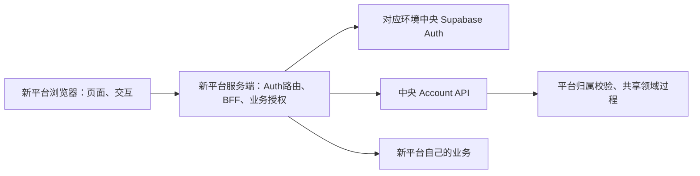

# 新平台用户系统接入手册

适用对象：新平台开发Agent、中央平台维护Agent、项目所有者。主路径为Next.js App Router + Node服务端；其他技术栈按第13节适配。本文维护当前可用方法，不把规划、参考页面或测试脚本写成已发布的一键接入产品。

文档版本基线：2026-09-15；SDK当前版本0.1.0，Registry为local-only。每次接入记录实际中央commit、SDK版本及tarball SHA-256，不能只凭本文日期判断兼容。字段以[Account OpenAPI](../reference/contracts/account.openapi.json)、[DTO](../../packages/domain/src/contracts/api.ts)和[SDK源码](../../packages/account-server/src/index.ts)为准。

## 1. 从哪里开始

首次接入按第2–10节顺序执行，再按需接订阅/文件等能力，最后执行第14节验收。遇到外部账号、配置或商业决策缺口，按第3节向用户提出具体请求，同时继续不依赖该输入的工作。

- 中央项目开发先读[AGENTS](../../AGENTS.md)、[系统概览](../architecture/overview.md)、[开发发布流程](development-release-workflow.md)和本手册。
- 本次只改手册属于R0；实际SDK/BFF/Auth/平台接入通常为R3，不能因为复制参考代码就跳过staging。
- 不需要给每个新平台再建一套中央Supabase。每个环境共享该环境中央身份系统，以平台账户和Platform Key隔离平台。平台自己的业务数据库可以独立，但不复制中央权益账本。
- 同一Supabase项目共享身份，不等于不同域名已具备自动登录。默认各平台独立登录会话；跨域SSO不在当前接入承诺内。



### 1.1 可复用能力与交付状态

| 内容 | 当前可用来源 | 接入时的边界 |
| --- | --- | --- |
| 服务端API客户端 | `@kit/account-server` | Node服务端使用，含node:crypto，不导入浏览器；不假设纯Edge运行时兼容 |
| Auth合同与Next.js适配 | `@kit/account-auth`、`@kit/account-auth-nextjs` | 复用Cookie、刷新、退出fence、回调与会话协调；不是注册/找回密码整站生成器 |
| 类型与校验 | `@kit/domain`及其`/contracts`入口 | 不在Consumer复制SQL权益/配额算法；不把Key/兑换材料生成能力暴露给客户端 |
| 页面与BFF参考 | [apps/template-preview](../../apps/template-preview) | 可按需移植、可定制UI；独立安装必须解决引用依赖并验收 |
| 安装元数据 | [Registry manifest](../../registry/manifest.json)、[templates](../../registry/templates.json) | local-only，不是线上Registry；没有可承诺的通用一键安装命令 |
| SDK发行物 | `pnpm sdk:pack`的tarball和manifest | 包仍private，不能声称已发布npm；以本次产物hash核验 |

保持统一：认证边界、平台归属、订阅/配额/兑换/结算规则、错误语义、幂等和安全头。允许定制：页面布局、品牌、导航、展示文案和平台业务；价格/期限/权限/支付进度含义不能随UI改写。

## 2. 接入信息单与任务拆分

Agent先盘点新平台实际目录、框架、运行时和已有登录系统，不直接覆盖路由或package.json。若已有用户体系，需要先设计身份对应和迁移；不能凭相同邮箱静默合并账户。

```text
新平台名称/建议platform code：
新平台仓库、目录、当前分支：
技术栈/运行时/已有Auth：
需要功能：登录 / 平台激活 / 权益授权 / 资料 / 订阅购买 / 兑换 / 文件
Local地址、Staging域名、Production域名：
各环境中央API/Auth是否可用：
首批需要保护的业务接口和feature名称：
套餐、免费能力、注册/激活政策：
中央基线commit、SDK发行批次/版本/hash：
可用授权：本地代码 / Git / staging配置与部署 / 生产发布 / 真实支付
用户待办、Agent待办、阻塞和下一独立任务：
```

按最小闭环拆分：资料及环境盘点 → 发包与安装 → 中央平台配置 → 登录/会话 → principal/激活 → 一个业务接口的服务端授权 → 可选功能 → 独立消费者验收。不要未跑通登录就同时移植全部页面。

## 3. 用户与Agent分工：什么时候提示用户

“需要用户”可能是提供决定或凭据注入，也可能只是需要授权后由Agent代办。不要把本可由Agent完成的接线工作推给用户；已明确授权同一范围的操作不反复询问。真实Secret不要求粘贴到对话。

| 事项 | Agent先完成的准备 | 用户提供/完成的内容 | 未完成时可继续 |
| --- | --- | --- | --- |
| 技术栈/功能/业务授权 | 盘点代码，列需要保护的操作和最小接入方案 | 确定平台名称、业务feature、套餐及范围 | 文档、接口清单、Mock、页面骨架 |
| 仓库/托管/域名 | 列目标项目、域名与回调清单，核对现有权限 | 提供项目访问或授权、完成必须本人进行的登录/DNS确认 | 本地接入 |
| 中央平台登记 | 准备Local/Staging/Production各环境配置表 | 确认code、允许激活/购买政策；需要时以管理员MFA完成或授权操作 | 安装包和BFF实现 |
| Platform Key | 指定对应平台/环境、服务端变量和验证请求 | 经中央Admin流程签发并安全注入；不发聊天明文 | 无Key时停真实中央调用，用明确标记的Mock |
| Auth测试用户/邮件 | 列测试邮箱、确认邮件与回调场景 | 控制测试邮箱，完成验证码/MFA等本人步骤；决定注册策略 | 其他非邮件测试 |
| Provider/真实支付 | 准备商品、回调、金额/次数、退款和隔离清单 | 提供账号接入授权、确认真实交易范围 | 登录/权益Mock，不伪造渠道通过 |
| Staging验收 | 整理准确候选、配置差异、用例和清理范围 | 缺少环境或部署授权时补齐 | 独立Local验收 |
| Production | 完成可执行发布和恢复清单、门槛证据 | 明确允许目标版本/迁移/配置/交易动作 | 不触发生产，保留待发布版本 |

Agent提示模板：

```text
待办：请确认/完成【具体事项】。
原因：它阻塞【具体调用或验收】，当前已有【准备结果】。
目标：环境【Local/Staging/Production】、平台【code/内部标识】。
操作位置：【中央Admin模块/托管项目Secret设置/域名服务】。
需要决定或注入的变量名称：【仅名称，不含Secret值】。
完成确认：请回复“已配置”或决定；Agent随后执行【不泄密的验证】。
等待期间继续：【不依赖此事项的任务】。
```

不得代用户虚构域名、Provider账号、商业feature或生产授权；也不能只说“给我环境变量”而不说明每项的用途、来源、环境和存放位置。

## 4. 三环境配置与中央准备

### 4.1 环境对应

| 项目 | Local | Staging | Production |
| --- | --- | --- | --- |
| 新平台前端/BFF | 本地Next.js | 托管HTTPS测试站 | 正式托管站 |
| 中央Auth/API/Storage | 本机Supabase Docker及已启动API | 独立Hosted staging | 独立Hosted production |
| 平台、Key、用户、码 | Local独立fixture | Staging独立fixture | 正式配置与业务数据 |
| 数据处理 | Local重置需确认范围 | 默认保留，按测试批次清理 | 不用于失败注入或测试清空 |

前端运行在本机但连接Hosted staging属于远程联调，不计纯Local。Local/Preview不能连接Production。每个环境独立登记和签发Key；可复用platform code语义，但不要假设UUID相同。多本地平台尽量用不同hostname/浏览器配置隔离，Cookie不按端口隔离，同一localhost不同端口可能共享同名Cookie。

### 4.2 中央维护Agent的准备清单

1. 确认中央API/Auth可用及实际部署版本。仅有前端页面不代表后端已启动；不因新平台接入擅自启动/重置共享数据库。
2. 在中央Admin的平台目录登记新平台，记录环境、platform_id/code、active状态和allow_activation；已有平台先核对再复用，不重复创建。
3. 在该平台Origins中登记精确scheme/host/port；回调URL按Auth合同登记。中央平台Origins和Supabase Auth Redirect URLs是不同配置，都需核对。
4. 在对应Supabase Auth项目登记实际回调路径、邮件模板与测试接收范围；共享Auth不能随便把唯一Site URL改成新平台而影响其他平台，逐流程明确redirectTo。
5. 经中央Admin平台Key的创建、部署确认流程签发服务端Key，记录key_id/状态/版本而不记录明文。用正确平台Key读principal/目录，错误Key和撤销Key必须被拒。
6. 按业务决定配置Free/paid Plan、feature与商品映射。开通平台和允许激活不等于已开放购买；Provider/调度门槛未过保持购买关闭。
7. 准备专用普通测试用户。中央system_admin不是普通Consumer测试用户，不能用管理员身份绕过平台账户校验。

参考实现：[平台目录](../../apps/admin/features/platforms/platform-directory.tsx)、[Origins](../../apps/admin/features/origins/platform-origins-page.tsx)、[平台Key](../../apps/admin/features/platform-keys/platform-keys-page.tsx)、[平台订阅配置](../../apps/admin/features/platform-settings/subscription-config-panel.tsx)。UI位置变化以当前导航为准，不在手册保存真实项目URL或密钥。

### 4.3 新平台 `.env.example` 参考

以下为空值/明显虚构示例。Agent生成模板可以提交；真实`.env.local`必须忽略，先检查新平台.gitignore。不要原样复制中央仓库现有.env.local。

```dotenv
# Local：以下示例要求访问 http://localhost:3001
TEMPLATE_ORIGIN=http://localhost:3001
NEXT_PUBLIC_SUPABASE_URL=http://127.0.0.1:54321
NEXT_PUBLIC_SUPABASE_PUBLISHABLE_KEY=
# 中央account-api直接Deno运行默认8000，必须与实际启动端口一致
ACCOUNT_API_URL=http://127.0.0.1:8000
ACCOUNT_API_TIMEOUT_MS=5000
ACCOUNT_PLATFORM_KEY=
```

```dotenv
# Hosted示意：全部替换为目标环境真实配置，example.invalid不可运行
TEMPLATE_ORIGIN=https://platform-staging.example.invalid
NEXT_PUBLIC_SUPABASE_URL=https://auth-staging.example.invalid
NEXT_PUBLIC_SUPABASE_PUBLISHABLE_KEY=
ACCOUNT_API_URL=https://api-staging.example.invalid/functions/v1/account-api
ACCOUNT_API_TIMEOUT_MS=5000
ACCOUNT_PLATFORM_KEY=
```

| 变量 | 谁提供、放哪里 | 验证要点 |
| --- | --- | --- |
| `TEMPLATE_ORIGIN` | 新平台部署方；服务端配置 | 与浏览器Origin精确一致；域名含路径不合法，不混localhost/127.0.0.1 |
| `ACCOUNT_API_URL` | 中央部署方；新平台服务端 | 直接Deno用实际端口；Hosted包含`/functions/v1/account-api`，不再加业务`/v1`；BFF/SDK会追加它 |
| `ACCOUNT_API_TIMEOUT_MS` | 新平台服务端配置 | BFF/SDK 到中央 Account API 的 deadline，当前参考实现默认 5000ms、最大 30000ms；超时按上游不可用 fail closed |
| `ACCOUNT_PLATFORM_KEY` | 中央Admin签发；新平台服务端Secret | 选择平台依据；不得放NEXT_PUBLIC、URL、客户端存储或聊天 |
| `NEXT_PUBLIC_SUPABASE_URL` | 中央Auth项目配置；允许公开 | 必须与API及Key同环境 |
| `NEXT_PUBLIC_SUPABASE_PUBLISHABLE_KEY` | 对应Auth项目公开Key | 允许公开不是业务平台Key；不能替换为secret/service_role |
| `SUPABASE_URL`、`SUPABASE_PUBLISHABLE_KEY` | Auth服务端可选显式覆盖 | 当前Auth helper支持，设置时必须与公开配置同环境，不制造两套Auth |
| `NODE_ENV` | 框架/部署工具控制 | Hosted staging也用production构建/运行，HTTPS Secure Cookie；不能设development绕过安全行为 |

Consumer不需要中央SQL URL、SUPABASE_SECRET_KEY、HMAC、Worker Token、Provider Token、Webhook密钥。平台标识由Key绑定，不给SDK杜撰`platformId`/`platformCode`构造参数；当前客户端构造仅使用baseUrl/platformKey等实际参数。

参考模板端口可能是8787，直接Deno默认可能是8000；两者是部署选择，不可照抄。以实际进程和请求为准，先确认完整URL后测试。`NEXT_PUBLIC_ENVIRONMENT`即使作为标签也不能证明环境安全；必须核对真实端点和凭据组合。

Next.js公开环境值可能在构建时内联；不能把指向staging的bundle原封不动搬到production。用同一源码/锁文件和明确生产构建输入，扫描产物中的环境地址。详见[配置](../reference/configuration.md)和[官方环境变量说明](https://nextjs.org/docs/app/guides/environment-variables)。

## 5. SDK交付、安装与版本锁定

### 5.1 中央发包

中央维护Agent先核对任务范围、工作区和SDK测试，在明确产物目录后运行：

```powershell
# 中央仓库根目录；确认默认 artifacts/sdk 是专属可重建产物目录
pnpm sdk:pack
```

[脚本](../../tooling/scripts/src/sdk-pack.mjs)会清空目标目录并重建四个包的dist，不能将`M5_SDK_PACK_DESTINATION`指向新平台源码、下载目录或共享文件夹。软件安装/缓存遵守根AGENTS，不为文档示例擅自安装工具。

交付四个tarball、同批manifest.json、中央commit、测试状态、兼容说明和本手册。当前常见文件名为`kit-domain-0.1.0.tgz`、`kit-account-auth-0.1.0.tgz`、`kit-account-auth-nextjs-0.1.0.tgz`、`kit-account-server-0.1.0.tgz`；实际名字/版本以产物manifest为准。

### 5.2 新平台安装

将审核后的发行物放新平台自己的`vendor/aisenhub-sdk/`。每个tarball用SHA-256对比可信渠道提供的manifest；manifest与tarball一起被篡改时单纯对比hash不能证明来源，需要确认发行commit和提供方。不要让生产构建依赖开发者电脑的绝对路径。

以下为当前0.1.0批次的package.json合并片段；不要覆盖新平台原有依赖：

```json
{
  "dependencies": {
    "@kit/domain": "file:vendor/aisenhub-sdk/kit-domain-0.1.0.tgz",
    "@kit/account-auth": "file:vendor/aisenhub-sdk/kit-account-auth-0.1.0.tgz",
    "@kit/account-auth-nextjs": "file:vendor/aisenhub-sdk/kit-account-auth-nextjs-0.1.0.tgz",
    "@kit/account-server": "file:vendor/aisenhub-sdk/kit-account-server-0.1.0.tgz"
  }
}
```

使用pnpm时在新平台根`pnpm-workspace.yaml`合并以下overrides，保留原packages和其他配置，避免传递的私有包依赖去公共npm解析：

```yaml
overrides:
  '@kit/domain': 'file:vendor/aisenhub-sdk/kit-domain-0.1.0.tgz'
  '@kit/account-auth': 'file:vendor/aisenhub-sdk/kit-account-auth-0.1.0.tgz'
  '@kit/account-auth-nextjs': 'file:vendor/aisenhub-sdk/kit-account-auth-nextjs-0.1.0.tgz'
  '@kit/account-server': 'file:vendor/aisenhub-sdk/kit-account-server-0.1.0.tgz'
```

```powershell
# 新平台根目录；第一次按审核后的依赖生成/更新锁文件
pnpm install --store-dir E:/AppData/pnpm
# 锁文件提交后，后续干净安装和CI使用
pnpm install --frozen-lockfile --store-dir E:/AppData/pnpm
```

先核对新平台包管理器和已有锁文件，不混用npm/yarn/pnpm。当前参考工具链由[Registry](../../registry/manifest.json)记录Node24.19.0、pnpm11.18.0、Next16.3.0；这是仓库基线，不代表应强行升级所有既有平台。不同版本先跑兼容验证，不能盲用latest。

不要复制`workspace:*`、`catalog:`到没有中央workspace/catalog的新项目；它们不是公开npm版本。参考页面若引入`@kit/ui`、`@kit/shared`、样式、字体或其他组件，四个核心包并不包含这些依赖：优先用平台自己的UI，只复制必要接线；整页移植需逐个盘点并另交付所需包。

现有独立安装探针[示例](../../tests/spikes/consumer/m5-05-install.mjs)会删除固定临时消费者目录并复制参考项目，是验证脚本而非新平台安装器。不得让它指向或覆盖真实新平台仓库。

## 6. 最小参考文件清单

使用新平台的`app/`或`src/app/`一种布局。下面是建议目标结构，不声称安装SDK会自动生成这些文件：

```text
app/
  _lib/auth-session.ts
  login/page.tsx
  api/auth/_lib.ts
  api/auth/login/route.ts
  api/auth/refresh/route.ts
  api/auth/logout/route.ts
  api/auth/callback/route.ts
  api/v1/[...path]/route.ts
  api/protected/advanced-config/route.ts
```

| 要移植的能力 | 当前完整参考源码 | 必须保留 |
| --- | --- | --- |
| 浏览器会话管理 | [auth-session.ts](../../apps/template-preview/app/_lib/auth-session.ts) | scope、错误类型、会话协调和安全重放 |
| Auth公共helper | [_lib.ts](../../apps/template-preview/app/api/auth/_lib.ts) | 精确Origin、CSRF、no-store、错误脱敏、session gate |
| 邮箱密码登录 | [login路由](../../apps/template-preview/app/api/auth/login/route.ts)、[登录页](../../apps/template-preview/app/login/page.tsx) | 服务端登录和HttpOnly Cookie；不向页面返回token |
| 刷新 | [refresh路由](../../apps/template-preview/app/api/auth/refresh/route.ts) | definitive invalid与暂时不可用区分、session对应、Cookie fence |
| 退出 | [logout路由](../../apps/template-preview/app/api/auth/logout/route.ts) | 远程撤销状态与本地退出区分，防止迟到刷新复活 |
| 回调 | [callback路由](../../apps/template-preview/app/api/auth/callback/route.ts) | 安全returnTo、code交换、flow fence；完整发起流程另验收 |
| BFF | [白名单代理](../../apps/template-preview/app/api/v1/%5B...path%5D/route.ts) | 路径/方法白名单、Cookie会话、Origin/CSRF、服务端Key、no-store、Account API deadline；不得改成通用路径代理 |
| 服务端业务授权 | [advanced-config](../../apps/template-preview/app/api/protected/advanced-config/route.ts) | 中央权益判定，不凭浏览器plan或本地到期时间放行 |
| 近期认证（可选） | [start](../../apps/template-preview/app/api/auth/reauth/start/route.ts)、[verify](../../apps/template-preview/app/api/auth/reauth/verify/route.ts) | 独立事件证明、同用户/原业务session绑定、敏感动作不可自动重放 |

Auth路由应从同一审核commit成套移植，不把复杂刷新/退出安全逻辑缩成几行自行重写。页面样式可以定制，安全helper和路由改动必须记录差异。不要在新平台同时装两套互相覆盖Cookie的刷新机制。

回调路由存在不代表OAuth发起、注册、找回/重置密码页面已经提供。当前Registry没有完整Signup/Forgot/Reset页面；需要这些能力时单独派发并验收邮件、PKCE/发起上下文和回调。第一次闭环可使用由受控方式准备的测试用户，但不能把它当正式自助注册已完成。

## 7. 浏览器登录、会话与BFF接线

下面TS代码为与当前导出一致的参考模块，需在新平台编译及实际验收，本文不宣称已完成该新平台E2E。

```ts
// app/_lib/auth-session.ts：仅浏览器导入/browser入口
'use client';
import { createAuthSessionManager } from '@kit/account-auth-nextjs/browser';

export const consumerAuthSession = createAuthSessionManager({
  scope: 'consumer',
  loginUrl: '/api/auth/login',
  refreshUrl: '/api/auth/refresh',
  logoutUrl: '/api/auth/logout',
});

export async function signIn(email: string, password: string) {
  const response = await consumerAuthSession.login({
    headers: { 'Content-Type': 'application/json' },
    body: JSON.stringify({ email, password }),
  });
  if (!response.ok) throw new Error('LOGIN_FAILED');
  // 不读取access/refresh token，不把密码或响应写日志
}

export async function readPrincipal() {
  const response = await consumerAuthSession.request('/api/v1/account/principal');
  if (!response.ok) throw new Error('PRINCIPAL_UNAVAILABLE');
  return response.json(); // 原始HTTP外壳为data + request_id
}

export async function activatePlatformAccount() {
  return consumerAuthSession.request('/api/v1/account/activate', { method: 'POST' });
}
```

UI需要处理HTTP错误code及`SessionExpiredError`、`SessionRetryRequiredError`、`AuthorizationUnavailableError`，提供登录/重试/处理中提示；示例的短错误不是完整产品UI。恢复会话后某些写操作会要求用户重新确认，不盲目重放。

请求走`consumerAuthSession.request`可复用会话/CSRF协调；不能认为任意原生fetch都自动带齐CSRF。登录只提交邮箱/密码，同源Auth路由设置Cookie；普通页面不拿平台Key和access/refresh token。密码/MFA输入只短暂用于认证，不记录到监控或持久存储。

### 7.1 BFF不是通用开放代理

移植参考BFF后，根据已接入功能收紧方法/路径白名单；不代理`/admin/api/v1`、任意上游URL或用户传入的主机。Key由服务端配置注入，用户身份从约定Cookie取；不能相信浏览器指定的user_id/platform_id/plan。

当前JSON响应保留data/request_id外壳；SDK方法返回的是已解包DTO，不要在SDK结果上再读`.data`。修改资料/偏好保留ETag/If-Match；Checkout/兑换保留Idempotency-Key；敏感证明优先使用HttpOnly Cookie及服务端验证。

二进制上传不可直接照抄当前通用BFF的`request.text()`转发。要接文件，必须验证字节完整性、请求体上限、Content-Type与流式/有界读取策略，再按第11节验收；不把参考代理视为所有文件类型已可直接生产使用。

## 8. 平台激活与账户状态

登录成功说明Auth身份可用，不说明该用户已在当前平台激活。先读principal，再按状态显示或请求激活：

| 状态/结果 | 新平台行为 |
| --- | --- |
| `account_status=not_activated` | 展示加入/激活操作；按产品决定是否自动触发，经中央activate接口执行 |
| `active` | 继续读取订阅/资料；业务授权仍单独校验 |
| `suspended` / `closed` | 显示准确状态和允许的支持操作，不本地改成active |
| `platform_status=disabled` | 停止受保护业务；principal可用于诊断，不表示可放行 |
| `ACTIVATION_DISABLED` | 提示平台未开放激活，向中央维护者报告；不自行开关 |
| `UNAUTHORIZED` / `SESSION_REVOKED` | 按会话管理器处理登录/退出，不重建用户绕过 |

当前SDK方法为`getPrincipal(accessToken)`和`activate(accessToken)`，不是`activateAccount`。DTO字段是`user_id/platform_id/platform_account_id/account_status`等snake_case；不要照概念示例改成另一套字段。

## 9. 服务端SDK与业务授权参考

普通API客户端只在新平台服务端创建。以下是建议新建`lib/central-account.ts`的完整模块，secret只在调用时读取；禁止从Client Component导入它：

```ts
import { createAccountApiClient } from '@kit/account-server';

export function centralAccountClient() {
  const baseUrl = process.env.ACCOUNT_API_URL;
  const platformKey = process.env.ACCOUNT_PLATFORM_KEY;
  if (!baseUrl || !platformKey) throw new Error('CENTRAL_ACCOUNT_NOT_CONFIGURED');
  return createAccountApiClient({ baseUrl, platformKey, timeoutMs: 5_000 });
}
```

建议受保护GET路由如下；`advanced_config`必须由业务决定并在中央Plan features中确实配置。换成新业务时先确认feature名字，不由Agent随意杜撰付费规则：

```ts
// app/api/protected/advanced-config/route.ts
import { NextRequest } from 'next/server';
import { authCookieNames, authSessionGate } from '@kit/account-auth-nextjs';
import { authorizeProtectedFeature, createAccountApiClient } from '@kit/account-server';

export const runtime = 'nodejs';
export const dynamic = 'force-dynamic';

export async function GET(request: NextRequest): Promise<Response> {
  const id = crypto.randomUUID();
  const reply = (body: unknown, status: number) => Response.json(body, {
    status,
    headers: { 'Cache-Control': 'no-store', 'X-Request-Id': id },
  });
  const names = authCookieNames('consumer');
  const accessToken = request.cookies.get(names.access)?.value;
  const gate = authSessionGate({
    accessToken,
    refreshToken: request.cookies.get(names.refresh)?.value,
    logoutFence: request.cookies.get(names.logoutFence)?.value,
    loginAck: request.cookies.get(names.loginAck)?.value,
  });
  if (!accessToken || !gate.ok)
    return reply({ error: { code: 'UNAUTHORIZED' }, request_id: id }, 401);
  const baseUrl = process.env.ACCOUNT_API_URL;
  const platformKey = process.env.ACCOUNT_PLATFORM_KEY;
  if (!baseUrl || !platformKey)
    return reply({ error: { code: 'AUTHORIZATION_UNAVAILABLE' }, request_id: id }, 503);

  const result = await authorizeProtectedFeature({
    client: createAccountApiClient({ baseUrl, platformKey }),
    accessToken,
    feature: 'advanced_config',
  });
  if (!result.ok) return reply(
    { error: { code: result.code }, request_id: id },
    result.code === 'AUTHORIZATION_UNAVAILABLE' ? 503 : 403,
  );
  // 仅示范授权成功响应；真实业务放在此后，还须验证业务资源归属。
  return reply({ data: { authorized: true }, request_id: id }, 200);
}
```

session gate检查Cookie会话上下文，不替代中央身份/撤销/权益验证。`authorizeProtectedFeature`会调用中央`getSubscription`，要求effective_status为active，指定feature时要求该值严格为true；中央错误返回AUTHORIZATION_UNAVAILABLE，不降级Free放行。

feature授权也不等于具体资源所有权或配额扣减。平台自己的资源仍须按可信账户映射验证归属；需要原子配额消耗时走已有受控领域合同，不能“先读剩余量后本地扣”。上面的GET示例不能直接改成有副作用的GET；POST写接口还须Origin/CSRF、输入、幂等和资源授权。

## 10. 最小接入验收顺序

1. 启动对应Local中央实例/API与新平台，确认实际端口、Auth URL、API base、Key归属。
2. 匿名访问公开商品/套餐；受保护接口匿名拒绝，不因为公开页需要Key而把Key发浏览器。
3. 用专用普通测试用户登录，确认HttpOnly session Cookie、no-store和不返回token。
4. 读取principal；首次平台未激活时按规则activate，再查询active账户。测试另一用户不能读取本用户账户/资源。
5. 配置有/无`advanced_config`权益的fixture，直接请求业务API分别验证允许/拒绝；隐藏按钮不能代替此测试。
6. 测试中央不可用、会话过期、退出后旧Tab/迟到刷新；确保不错误放行或复活退出。
7. 在独立新平台目录安装、构建、运行，不能依赖中央workspace软链接或开发机绝对路径。
8. 按[发布流程](development-release-workflow.md)进入Hosted staging，验证真实HTTPS/Cookie/回调/网关；生产发布与环境配置另有明确授权。

## 11. 可选能力如何逐项接入

| 能力 | 当前入口 | 接入与失败要求 |
| --- | --- | --- |
| 资料/偏好 | SDK getProfile/patchProfile/getPreferences/patchPreferences；BFF `/api/v1/profile`、`preferences` | 读取ETag后If-Match更新；412重新读取并让用户处理冲突；不发送归属字段 |
| 商品/权益展示 | listPublicPlans/listSubscriptionProducts/getSubscription | 目录不是用户授权；purchasable/reason来自中央；99年有限期不能写永久 |
| Checkout | createSubscriptionCheckout、getSubscriptionCheckout、getSubscriptionCheckoutByIdempotencyKey | productCode只monthly/yearly/lifetime；创建前保存同一意图key；断响应先按key恢复，不新建订单掩盖未知结果 |
| 兑换 | redeemSubscription(accessToken, code, idempotencyKey) | 浏览器只向同源BFF提交；码不日志/URL/持久存储；同意图重试保留key，不本地决定Plan或期限 |
| 文件 | createUploadIntent/uploadContent/listConfigFiles/downloadConfigFile/deleteConfigFile | 原始字节有界上传、不得直连Storage；PUT无自动重试假设；202删除跟踪状态；对应BFF二进制接线先验收 |
| 关闭账户/身份删除 | closeAccount/requestIdentityDeletion、近期认证路由 | 明确“当前平台关闭”与“全局身份删除”不同；高风险确认和近期证明，禁止自动重放敏感认证 |
| 注册/密码找回/OAuth | 当前仅有部分底层适配及callback参考 | 先盘点缺失页面/发起路由和邮件策略，单独实施完整流程，不凭callback存在宣称已支持 |

消费方不用接Provider Webhook或安装订单结算cron。支付入口、回调、查单、结算和退款/审计由中央维护；新平台展示中央进度，不能信任支付页跳转参数当作付款凭证。

支付状态至少区分pending、已付待核验、核验/处理中、granted、当前active、retryable、manual_review和failed；使用当前DTO的实际字段/枚举映射，不强塞成同一个status。刷新、跨Tab、弹窗拦截、迟到支付、退款、未来生效Grant均需测试。当前匿名`listSubscriptionProducts()`不接受用户token参数；不要为显示用户购买资格虚构SDK签名，按当前BFF/合同核对或单独提出合同扩展。

## 12. 常见问题与Agent定位顺序

| 现象 | 先检查 | 不允许的“解决方式” |
| --- | --- | --- |
| npm找不到@kit包/workspace报错 | 是否使用同批tarball、overrides、完整传递依赖和锁文件 | 随意安装公共同名包/复制中央源码绝对路径 |
| Auth已登录，中央401 | Cookie scope/fence、Auth项目、Key状态、中央session校验 | 把service_role当用户Token或关闭鉴权 |
| 403 INVALID_INPUT | Origin精确值、CSRF Cookie/header、请求方法 | 放开任意Origin或关CSRF |
| ACCOUNT_NOT_ACTIVATED | principal与allow_activation、是否普通用户 | 直接SQL插平台账户或用管理员绕过 |
| AUTHORIZATION_UNAVAILABLE | 中央可用性、API base/网关、Key/会话、日志request_id | 当成Free或临时放行业务 |
| Checkout不可购买 | purchasable reason、平台商品配置、verified mapping、开关和发布门槛 | 自己拼裸Provider商品URL或伪造payment_url |
| 页面刷新后掉线/退出复活 | 成套Auth适配、refresh错误分类、logout fence、同host Cookie冲突 | 将refresh token放localStorage共享 |
| 上传后文件损坏 | BFF是否用了text转码、真实字节/Content-Type/大小 | 直接浏览器写Storage绕过中央额度 |
| Hosted能构建但无法登录 | 构建时公开配置、Secure Cookie、精确回调和同环境映射 | production运行时设development或复制Local密钥 |
| UI复制后缺模块/样式 | @kit/ui/shared及组件/字体/样式依赖清单 | 整仓覆盖新平台或删除失败测试 |

## 13. 非Next.js平台的接入方式

Node后端可复用`@kit/account-server`，自行实现该框架的同源BFF和安全会话适配；其他语言按Account OpenAPI实现服务端客户端。浏览器仍不能持有Platform Key。不能承诺Next专用包在Vue/Nuxt/Python/移动端直接可用。

纯静态SPA若没有可信服务端，无法安全使用当前Platform Key合同，需要增加合适BFF或先设计新的受控接入合同。移动端/桌面端也不能把服务端Key打包进安装文件。新增适配需完整验收登录、刷新、退出、CSRF适用边界、平台归属、缓存和错误合同，不能仅改HTTP调用语法。

## 14. 验收矩阵与完成定义

| 层次 | 必须验证 | 证据 |
| --- | --- | --- |
| 发行物 | 来源commit、四包版本/hash、无workspace残留、独立安装 | manifest核对及干净安装日志 |
| 编译/打包 | 新平台类型、构建、server/client入口边界 | 新平台实际命令与退出码；不只中央构建 |
| Local Auth | 登录、过期/刷新、退出、撤销、跨Tab、邮件相关适用项 | 浏览器+BFF+Auth链路，无token截图 |
| Local中央业务 | principal/激活、真实服务端授权、资料/购买/兑换/文件适用项 | 正向与失败断言、最终中央状态 |
| 安全隔离 | 错环境Key/JWT、跨用户/平台、Cookie/CSRF、无浏览器Secret | 拒绝结果及脱敏请求ID |
| 并发恢复 | 同意图重复、断响应、刷新重放、兑换竞争/文件失败适用项 | 真实多会话/连接及最终唯一性 |
| Hosted staging | 实际域名/构建/网关/邮件/会话/中央链路 | 与候选版本绑定的验收记录 |
| Provider | Mock/沙箱/真实测试明确区分；仅购买相关适用 | 渠道事实、中央Order/Grant、恢复结果 |
| Production | G0–G5发布门槛、批准、G6观察 | 与Git合并分开的部署记录 |

结果仅PASS/FAIL/NOT_RUN/PARTIAL/BLOCKED，不适用另写理由。没有独立平台测试或Hosted环境就写“文档/本地准备完成，接入验收未完成”，不能用中央旧测试记录充当新平台成功。

中央已有入口：`pnpm docs:check`、`pnpm contracts:check`、`pnpm test:registry:m5-04`、`pnpm test:sdk:m5-02`、`pnpm test:consumer:m5-05`、`pnpm test:e2e:t16-r2`。执行前读脚本：打包/独立安装脚本会重建产物和临时目录，E2E依赖本地服务及fixture；它们不自动验证每个新平台。新平台验收命令从其package.json核对，不要求不存在的脚本冒充通过；缺用例先实现。

staging默认保留基础数据和证据，测试按批次隔离清理。未完成真实测试付款、回调、Job或退款不能清掉；详见开发发布流程第5.2节。首次开启真实购买前由中央完成Provider/G-OPS门槛，新平台页面上线不自动获得收费授权。

## 15. 给新平台Agent的提示词

```text
请按中央用户系统 docs/guides/platform-onboarding.md 接入当前平台。
先阅读本项目AGENTS及中央开发发布流程，盘点技术栈、已有Auth和已安装依赖。
先列接入信息单、中央/新平台文件变更、环境映射和最小验收方案。
仅接入本次选择的功能，不重写中央权益/配额/兑换/支付算法。
使用审核版本的SDK tarball及hash；参考Auth/BFF代码来自同一中央commit。
先跑通登录→principal→激活→一个业务API的服务端权益授权，再做可选页面。
缺平台登记、域名、Key、邮箱/MFA或部署授权时，给我明确待办和验证方式；
不要让我把真实Secret发聊天，继续不依赖它的工作，不伪造环境和成功结果。
保持平台UI可定制，安全/协议复用包；不得把Platform Key放浏览器。
最终交付文件清单、安装/环境说明、Local及Staging测试、未完成项、升级及回退方法。
Git操作遵循目标仓库授权，不把中央仓库的自动合并授权扩大到未知新仓库。
```

新平台AGENTS应指向可访问的手册位置及确切中央版本。若Agent没有中央仓库访问权，交付同版本手册、合同、参考文件和发行物作为接入资料；标注来源和版本，不让失去链接目标的手册成为唯一依据。后续升级统一从中央更新，不在不同平台各写一套相互矛盾的协议。

## 16. 持续维护与升级清单

中央维护SDK、Auth、BFF、DTO/OpenAPI、Registry、配置或参考页面时，必须检查本手册是否受影响，并在同一任务同步。手册维护现状，不追加讨论流水；实际失败、测试和发布证据独立保留。

| 改动 | 必须同步检查 |
| --- | --- |
| SDK方法/exports/依赖/包版本 | 方法示例、tarball文件及overrides、Node/browser边界、传递依赖和兼容消费者 |
| Auth Cookie/刷新/回调 | 成套参考文件、环境变量、CSRF/fence、注册/邮件能力边界、错误处理 |
| BFF/API/DTO/错误码 | 白名单、header/ETag/幂等、snake_case与外壳、二进制、所有新平台消费者 |
| 平台配置/Key/Origin | 用户待办、签发确认流程、环境隔离与撤销验证 |
| 支付/权益/兑换/文件 | 页面承诺、状态映射、服务器授权、Provider/任务门槛及失败恢复 |
| Registry/工具链 | 真正存在的路由、安装方式、兼容版本和独立项目验收 |

新平台升级：记录当前版本/定制差异 → 阅读中央变更及合同兼容 → 校验新发行物 → 更新四包/overrides及锁文件 → 编译与本地回归 → staging验收 → 发布批准。不得覆盖平台自有页面；按参考commit差异手动合并安全接线修复。相同0.1.0版本不同hash必须按不同发行批次记录，不用版本号掩盖内容变化。

回退只回退兼容的应用/SDK版本，中央迁移和交易数据不能随Consumer回退删除。中央接口采用兼容扩展并说明旧消费者支持窗口；不兼容变更先同步所有受影响平台，不能仅更新手册就发布。

手册代码块是参考与接线依据，不替代真实编译及验收；维护时检查链接、路径、导出/方法签名、示例语法、配置名和清理脚本边界。上线状态只有实测后才能更新。

官方依据：[Supabase服务端认证](https://supabase.com/docs/guides/auth/server-side/creating-a-client)、[Auth回调白名单](https://supabase.com/docs/guides/auth/redirect-urls)、[Next.js环境变量](https://nextjs.org/docs/app/guides/environment-variables)。本项目的Cookie/session/撤销合同仍需保留，不机械复制官方通用示例覆盖现有实现。
