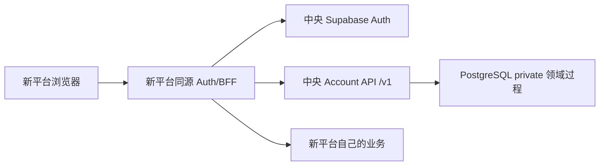

# 新平台用户系统接入手册

适用对象：新平台开发 Agent、中央平台维护 Agent、项目所有者。当前主路径是 **Contract-First HTTP + 平台自有 Auth/BFF**：Consumer 不安装 AisenHub runtime SDK，公共稳定面是 Account/Admin canonical OpenAPI 与 `/v1` HTTP 语义。

接入时必须记录中央 commit、Account contract major、目标平台仓库 commit 和实际验证结果。字段与状态码以 [Account OpenAPI](../../contracts/account/v1/openapi.json) 为准；兼容规则见 [Account compatibility](../../contracts/account/v1/COMPATIBILITY.md) 和 [changelog](../../contracts/account/v1/CHANGELOG.md)。

## 1. 架构与边界


```mermaid
flowchart LR
    Browser[新平台浏览器] --> BFF[新平台同源 Auth/BFF]
    BFF --> Auth[中央 Supabase Auth]
    BFF --> API[中央 Account API /v1]
    API --> Rules[PostgreSQL private 领域过程]
    BFF --> Business[新平台自己的业务]
```

必须保持统一的内容：身份/会话边界、Platform Key 归属、Account `/v1` wire contract、错误码、幂等、金额/期限/权益/配额语义、支付进度和安全头。允许定制：页面、品牌、导航、文案和平台自己的业务资源。

当前仓库中的职责：

| 内容 | 当前来源 | Consumer 边界 |
| --- | --- | --- |
| Account 公共合同 | [contracts/account/v1/openapi.json](../../contracts/account/v1/openapi.json) | 唯一公共字段/状态/鉴权来源；保持 `/v1` 兼容 |
| Admin 公共合同 | [contracts/admin/v1/openapi.json](../../contracts/admin/v1/openapi.json) | 仅 Admin 集成使用 |
| Reference Consumer | [apps/template-preview](../../apps/template-preview) | 可复制所需 Auth/BFF/integration 代码，复制后由目标平台自行拥有 |
| Consumer Auth | [app/_lib/auth](../../apps/template-preview/app/_lib/auth) | Cookie/session/refresh/logout fence、Supabase request-scoped adapter |
| Consumer HTTP integration | [app/_lib/integration](../../apps/template-preview/app/_lib/integration) | DTO guard、bounded input、fail-closed 授权辅助 |
| Consumer BFF | [api/v1 route](../../apps/template-preview/app/api/v1/%5B...path%5D/route.ts) | server-only Platform Key、allowlist、Origin/CSRF、deadline、no-store |
| Registry | [manifest](../../registry/manifest.json)、[templates](../../registry/templates.json) | 记录 contract major、Reference Consumer 和真实模板路由；不分发 Account runtime 包 |
| `packages/domain` | 中央内部模块 | 不复制到 Consumer，不作为公共 runtime 依赖；领域算法仍由中央 SQL/API 决定 |

同一 Supabase 环境共享身份不等于跨域自动登录。默认各平台保持自己的同源会话；跨域 SSO 不在当前接入承诺内。

## 2. 接入信息单与最小闭环

开始编码前填写：

```text
新平台名称 / platform code：
目标仓库、分支、当前 commit：
技术栈 / 运行时 / 已有 Auth：
需要功能：登录 / 激活 / 权益授权 / 资料 / 订阅 / 兑换 / 文件
Local origin / Production origin：
中央 Account API 与 Supabase Auth 环境：
首个受保护业务接口与 feature 名称：
中央基线 commit：
Account contract major / changelog revision：
可用授权：本地代码 / Git / 生产发布 / 真实支付：
阻塞、用户待办、Agent 待办：
```

按最小闭环实施：**合同冻结 → 环境与平台配置 → Auth 会话 → principal → activate → 一个服务端 protected route → 再接可选资料/订阅/文件能力 → 独立平台验收**。不要在登录和 principal 尚未跑通时同时复制全部页面。

## 3. Contract baseline 与升级规则

1. 固定中央 commit，并读取 Account `v1` OpenAPI、compatibility、changelog。
2. 记录当前接入接受的 contract major。Registry 的 `contract_compatibility` 只是中央参考应用当前验收信息，不替代目标平台自己的验证。
3. `/v1` 采用 expand-first：可兼容新增字段/operation；删除 operation、删除 schema 字段、收窄 enum 或改变既有鉴权/语义属于 breaking change，应进入新 major 或完成明确兼容迁移。
4. 中央仓库使用 `pnpm contracts:check` 与 `pnpm contracts:breaking`。目标平台没有同名脚本时，不伪造通过；至少把目标平台实际 HTTP 调用与当前 OpenAPI 对齐。
5. 不把 `packages/domain` 类型直接复制成公共协议来源，也不通过 workspace/private package 绕过 HTTP contract。

## 4. 环境配置与中央平台准备

每个环境独立登记 Platform、Origin、Platform Key 和 Auth redirect。Local/Preview 不连接 Production。

新平台服务端至少需要：

```dotenv
TEMPLATE_ORIGIN=http://localhost:3001
ACCOUNT_API_URL=http://127.0.0.1:8000
ACCOUNT_API_TIMEOUT_MS=5000
ACCOUNT_PLATFORM_KEY=
NEXT_PUBLIC_SUPABASE_URL=http://127.0.0.1:54321
NEXT_PUBLIC_SUPABASE_PUBLISHABLE_KEY=
```

| 变量 | 边界 |
| --- | --- |
| `TEMPLATE_ORIGIN` | 与浏览器 Origin 精确一致；用于 mutation Origin/CSRF 校验 |
| `ACCOUNT_API_URL` | 服务端中央 API base；Hosted 时包含实际 Edge Function base，不把业务 `/v1` 重复拼接 |
| `ACCOUNT_API_TIMEOUT_MS` | Reference Consumer 默认 5000ms、最大 30000ms；超时 fail closed |
| `ACCOUNT_PLATFORM_KEY` | Admin 签发的 server-only Secret；禁止 `NEXT_PUBLIC_`、URL、客户端存储、日志和聊天 |
| `NEXT_PUBLIC_SUPABASE_URL` | 允许公开；必须与目标中央环境一致 |
| `NEXT_PUBLIC_SUPABASE_PUBLISHABLE_KEY` | 允许公开；不能替换成 secret/service_role |

Consumer 不需要中央数据库 URL、Supabase secret key、HMAC、Worker token、Provider token 或 webhook secret。

中央维护者在真实 HTTP 前完成：平台登记与 active/allow_activation、Origins、Auth redirect、Platform Key 创建/部署确认、Plan/features/商品映射以及普通测试用户准备。system_admin 不能充当普通 Consumer fixture。

## 5. 从 Reference Consumer 复制并自行拥有集成代码

新平台不安装 AisenHub Account/Auth runtime package。选择同一审核 commit 的 Reference Consumer 作为源码参考，只复制实际需要的文件并在目标仓库中自行维护差异。

最小 Next.js 结构：

```text
app/
  _lib/
    auth/
      core.ts
      cookie-policy.ts
      server.ts
      browser-session.ts
      browser.ts
    integration/
      account-contract.ts
      authorization.ts
      bounded-body.ts
      validation.ts
  api/auth/_lib.ts
  api/auth/login/route.ts
  api/auth/refresh/route.ts
  api/auth/logout/route.ts
  api/auth/callback/route.ts
  api/v1/[...path]/route.ts
  api/protected/advanced-config/route.ts
  login/page.tsx
```

关键参考：

- [Consumer Auth server](../../apps/template-preview/app/_lib/auth/server.ts)：HttpOnly access/refresh、CSRF、login acknowledgement、logout fence、request-scoped Supabase。
- [Browser session](../../apps/template-preview/app/_lib/auth/browser-session.ts)：refresh single-flight、读取可安全重放、mutation 默认不重放、logout epoch、跨 Tab terminal hint。
- [Auth route helpers](../../apps/template-preview/app/api/auth/_lib.ts)：Origin、CSRF、错误外壳与 no-store。
- [Consumer BFF](../../apps/template-preview/app/api/v1/%5B...path%5D/route.ts)：method/path allowlist、服务端 Key、可信 Cookie、bounded body、upload admission、deadline。
- [Protected route](../../apps/template-preview/app/api/protected/advanced-config/route.ts) 与 [authorization helper](../../apps/template-preview/app/_lib/integration/authorization.ts)：中央权益不可用、暂停或缺 feature 时 fail closed。

Auth 路由必须成套移植并保留测试，不要把 refresh/logout/fence/replay 逻辑压缩成“简单 fetch wrapper”。页面可以重写；安全语义改变必须记录并重新验收。

## 6. 登录、会话与 BFF 不变量

- 浏览器只向同源 Auth/BFF 发请求；不接触 Platform Key、access token、refresh token。
- access/refresh 为 HttpOnly Cookie；CSRF 使用可读 Cookie + header；mutation 同时要求精确 Origin。
- callback 的 `returnTo` 只能是安全相对路径，不能携带 token/proof/password 等敏感 query。
- definitive refresh/session invalid 才进入 expired/logout；中央临时不可用不能被误判为授权成功。
- GET 等安全读取可在会话恢复后按既定策略重放；mutation 默认要求用户重新提交。只有明确 Idempotency-Key 且 body 可安全重放的操作才可采用受控 replay。
- logout 后迟到 refresh/login 不能恢复旧 session；跨 Tab 只传播 scoped terminal hint，不传播 token。
- BFF 必须是 allowlist，不代理任意 URL、Admin path 或浏览器指定的 host/platform/user。
- 上游 `request_id` 应保留用于支持与审计关联。

## 7. Principal、激活与业务授权

Auth 登录成功不等于平台账户已激活，也不等于拥有付费能力。推荐顺序：

1. 登录；
2. `GET /v1/account/principal`；
3. 若 `not_activated` 且产品允许，`POST /v1/account/activate`；
4. 再读取 subscription/profile 等；
5. 受保护业务在服务端读取中央 entitlement，并要求 `effective_status=active` 及目标 feature 严格为 `true`；
6. 中央不可用返回 `AUTHORIZATION_UNAVAILABLE`，不得降级成 Free、缓存旧授权或仅隐藏按钮。

平台自己的资源归属仍须独立验证。feature 授权不代表资源所有权，也不代表配额可以在 Consumer 本地扣减。

## 8. 可选能力接入

| 能力 | HTTP/BFF 入口 | 关键要求 |
| --- | --- | --- |
| 资料/偏好 | `/v1/profile`、`/v1/preferences` | GET 的 ETag + PATCH `If-Match`；412 后重新读取，不发送归属字段 |
| 商品/权益 | `/v1/plans`、`/v1/subscription/products`、`/v1/subscription` | 目录不是用户授权；金额/期限/`purchasable` 只信中央 |
| Checkout | `/v1/subscription/checkout` | 创建保留同一 Idempotency-Key；断响应优先按合同恢复，不重复付款 |
| 兑换 | `/v1/subscription/redeem` | code 不进日志/URL/持久存储；同意图保留 key |
| 文件 | upload-intent、content PUT、list/read/download/delete | 原始字节有界、不得直连 Storage；二进制不经过 text 转码；删除跟踪中央状态 |
| 关闭/身份删除 | close、delete-request + recent-auth | 区分平台关闭与全局删除；敏感认证不自动重放 |
| OAuth/注册/找回密码 | 当前只有部分 callback/底层能力 | 缺失页面与发起流程必须单独实现和验收，不能因为 callback 存在就宣称完整支持 |

Consumer 不接 Provider webhook、结算 worker 或中央 SQL。支付成功、结算和 entitlement grant 都由中央确认；浏览器跳转参数不是付款凭证。

## 9. 非 Next.js 平台

任何具备可信服务端的技术栈都可直接按 Account OpenAPI 实现 HTTP client 与同源 BFF。不要尝试复用 Next.js 源文件本身作为跨语言抽象。

必须重新实现并验证的语义包括：server-only Platform Key、Auth token/session 安全存储、Origin/CSRF 的适用边界、超时、no-store、request_id、Idempotency-Key、ETag/If-Match、二进制上传下载及 fail-closed 授权。

纯静态 SPA 没有可信服务端，无法安全持有当前 Platform Key；需要增加 BFF 或另行设计受控接入合同。移动/桌面安装包同样不能内置 server key。

## 10. 新平台验收

目标平台必须使用自己的命令和环境完成验证，中央旧测试不能代替新平台成功。最小矩阵：

| 层次 | 必须验证 |
| --- | --- |
| Contract | 接受的 central commit/contract major/changelog 已记录；实际请求字段/错误与 OpenAPI 对齐 |
| 编译/构建 | 目标平台 typecheck/build；没有中央 workspace/private package 依赖 |
| Auth | 登录、刷新、过期、退出、迟到请求、跨 Tab、callback/邮件适用项 |
| BFF | 匿名/已登录、Origin/CSRF、错误 Key/JWT、allowlist、deadline、no-store、无浏览器 Secret |
| Account | principal、激活、跨用户/平台拒绝、目标 feature 允许/拒绝、中央不可用 fail closed |
| 可选领域 | Profile 并发、Checkout/兑换幂等、文件二进制/配额/删除等实际启用项 |
| Local Supabase | 按[开发发布流程](development-release-workflow.md)运行适用本地 Auth/API/DB/Storage/E2E |
| Production | 与本地验收分开；按实际目标、配置、迁移、恢复和已有授权执行 |

中央仓库当前 gate：

```powershell
pnpm contracts:check
pnpm contracts:breaking
pnpm test:registry
pnpm test:reference-consumer
pnpm test:unit
pnpm typecheck
pnpm build
```

`pnpm test:reference-consumer` 会阻止已删除的 Account SDK 或中央 `@kit/domain` 重新进入 Reference Consumer，并检查必需 Auth/BFF/integration 与 canonical contracts。

## 11. 常见问题

| 现象 | 先检查 | 禁止做法 |
| --- | --- | --- |
| Auth 已登录但中央 401 | Auth 环境、Cookie fence、Platform Key、中央 session 校验 | service_role 冒充用户或关闭鉴权 |
| `403 INVALID_INPUT` | Origin、CSRF Cookie/header、method/body | 放开任意 Origin 或关闭 CSRF |
| `ACCOUNT_NOT_ACTIVATED` | principal、allow_activation、是否普通用户 | 直接 SQL 插账户或管理员绕过 |
| `AUTHORIZATION_UNAVAILABLE` | API base、deadline、中央可用性、request_id | 当成 Free/临时授权 |
| Checkout 不可购买 | `purchasable/reason`、商品映射、购买开关 | 拼裸 Provider URL 或伪造 payment_url |
| 退出后会话复活 | refresh/logout fence、epoch、同 host Cookie 冲突 | refresh token 放 localStorage |
| 上传损坏 | 二进制是否被 text 转码、真实 size/content-type | 浏览器直连私有 Storage |
| 构建能过但登录失败 | 构建时公开配置、Secure Cookie、callback/Origin | production 设 development 绕安全行为 |

## 12. 持续维护与升级

中央修改 Account/Admin OpenAPI、Auth Cookie/session、Reference Consumer BFF/DTO guard、Registry contract compatibility 或环境配置时，同一任务检查本手册。

升级流程：记录当前 central commit/contract major/本地定制 → 阅读 changelog/compatibility → 比较 Reference Consumer 安全接线差异 → 合并需要的修复 → 目标平台 typecheck/build/unit/Local 回归 → 再进入发布流程。

中央 `/v1` 只做兼容扩展；不兼容变更先建立新 major 或迁移窗口，并同步所有受影响 Consumer。Consumer 回退只能回退仍兼容的应用代码，不能随应用回退删除中央迁移或交易数据。

## 13. 给新平台 Agent 的提示词

```text
请按中央 docs/guides/platform-onboarding.md 以 Contract-First HTTP 方式接入当前平台。
先阅读目标仓库规则，并固定中央 commit、Account contract major、compatibility/changelog。
不要安装或重新引入 AisenHub Account/Auth runtime SDK，也不要依赖中央 @kit/domain。
从同一审核 commit 的 apps/template-preview 复制本次需要的 Auth/BFF/integration 代码，复制后由目标仓库自行拥有。
先完成登录 → principal → activate → 一个服务端 protected route，再接可选资料/订阅/兑换/文件。
Platform Key 只在服务端；浏览器不得持有 token、Key、SQL/Provider Secret。
中央不可用或 entitlement 不确定时 fail closed，不自行重算权益/配额/支付状态。
缺平台登记、Origin、Key、测试邮箱/MFA或生产授权时，明确列用户待办并继续不依赖它的工作。
最终交付目标仓库变更、contract baseline、环境变量名称、Local/本地 Supabase 测试、未完成项、升级与回退说明。
```

真实 Secret 不粘贴到对话或文档。最高测试环境为本地 Supabase；远程 Provider/Production 未授权时记录 NOT_RUN/BLOCKED，不用 Mock 冒充已联调。
