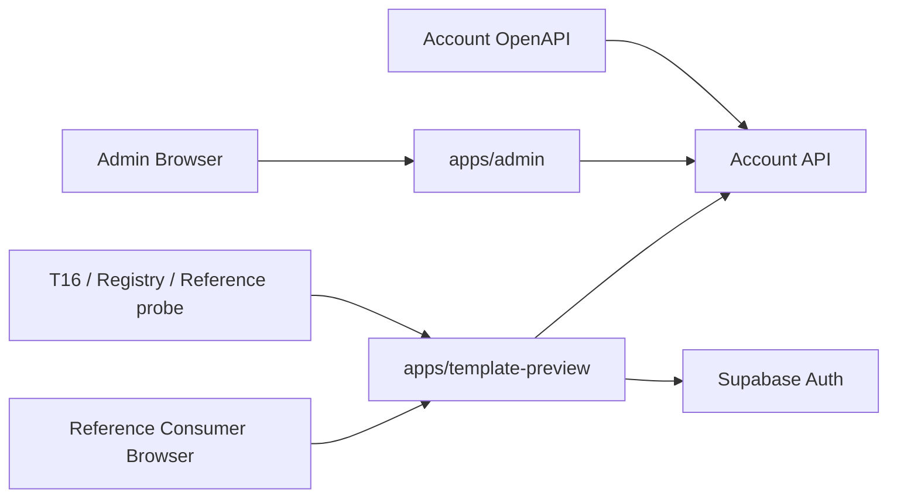
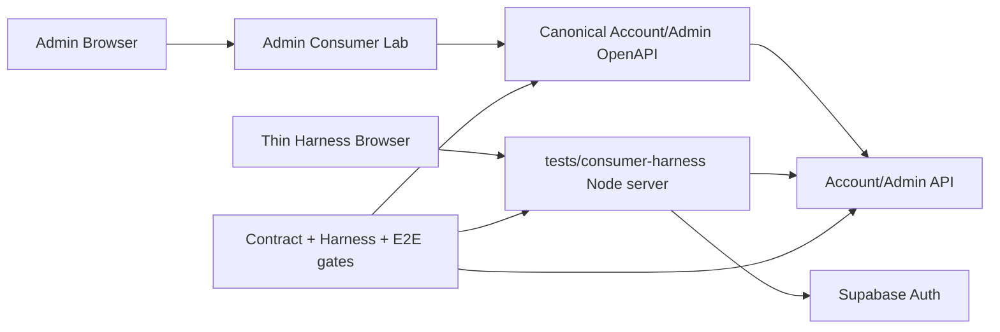

# Admin Consumer Lab 与 Consumer Conformance Harness 设计

状态：Completed

关联：[总计划](plan.md)

## 背景与当前问题

上一轮 `remove-sdk-contract-first` 已把 Consumer SDK 发行体系删除，并把公共边界收敛为 canonical OpenAPI + HTTP。但为了证明“没有 SDK 仍可完整接入”，仓库继续维护一个完整 Next.js Reference Consumer：`apps/template-preview`。

当前实现有三个明显成本：

1. `apps/template-preview` 是完整 Next.js workspace，包含账户、订阅、文件、登录、页面样式和大量交互；这些 UI 并不是公共合同本身，却会参与 root build/typecheck/unit 和升级维护。
2. Reference Consumer 的主要价值其实有两类：人工观察/调试，以及证明外部 Consumer 不依赖 Admin/Domain/private package。前者适合进入 Admin，后者只需要一个独立、最小、可执行的测试边界，不需要完整产品应用。
3. 重新审查发现 Contract-First 基础仍有治理缺口：`SubscriptionProduct.reason` 的 canonical OpenAPI 缺少服务端真实可返回的 `purchases_paused`；现有 breaking checker 也不能阻止“新增 required request 字段”等部分破坏性变化。删除 Reference Consumer 前必须先收紧这些基础，否则只是把第二套协议表达从一个应用迁到另一个测试目录。

本任务属于 R3：会删除 Consumer App、改变 BFF/Auth 测试路径、Admin 页面、Registry、合同检查和 R3 gate，但不修改数据库 schema、领域状态机、生产数据或 Provider 协议。

## 已冻结的目标

1. 删除 `apps/template-preview`，仓库不再维护第二个完整 Consumer 产品应用。
2. Admin 增加 `/admin/consumer-lab`，作为维护者的合同浏览、边界检查和本地 Conformance Harness 操作入口。
3. 新增 `tests/consumer-harness/`，它是 test-only、非 workspace、非部署产物的极薄 Consumer：原生 Node HTTP + 静态 HTML/浏览器 JavaScript；不使用 Next.js，不依赖任何 `@kit/*` runtime package。
4. Harness 只证明公开 Consumer 边界：Supabase Auth 基本登录/刷新/退出、HttpOnly session、Origin/CSRF、server-only Platform Key、Account `/v1` allowlist、no-store/request_id、幂等/ETag、文件二进制与 fail-closed 授权。它不是可复制的生产 UI 或业务 SDK。
5. 新平台接入的唯一机器可读合同继续是 `contracts/account/v1/openapi.json`；Harness 在运行时读取/检查 canonical contract，不维护手写 DTO 枚举作为第二事实源。
6. Admin Consumer Lab 不能作为“外部 Consumer 兼容已通过”的证据。它允许使用 Admin UI 依赖，但不能让 Contract gate 通过 Admin private helper、`@kit/domain` 或 DB 直连绕过 Harness。
7. Admin Lab 第一版不引入可写 Consumer 操作、不存储 Platform Key、不暴露 bearer token；核心价值是合同/操作可视化、配置 readiness 和本地 Harness 入口。真实 Consumer HTTP 行为由 Harness 自动化证明。

## 当前架构



当前 T16 同时启动两个 `template-preview` 实例和 Admin，验证跨平台、账户、文件、订阅、近期认证和 Admin 流程。Registry 也把 `apps/template-preview` 当成 `reference_consumer` 和模板路由来源。

## 目标架构



### Admin Consumer Lab

位置：`apps/admin/app/admin/consumer-lab` 与 `apps/admin/features/consumer-lab`。

职责：

- 展示当前 Account/Admin contract major、spec version、operation inventory 和 security scheme 摘要。
- 明确区分“Admin 内部能力”和“外部 Consumer 公共能力”。
- 展示 Conformance Harness 路径、Local 命令、所需非 Secret 配置名称及安全边界。
- 可展示仓库静态可确定的 readiness；不能伪造最近一次 Harness PASS，也不持久化测试结果。
- 不直接连接 SQL、Storage 或 Provider，不成为新的 Consumer BFF。

### Consumer Conformance Harness

位置：`tests/consumer-harness/`，不纳入 `pnpm-workspace.yaml`。

建议结构：

```text
tests/consumer-harness/
├── server.mjs
├── contract.mjs
├── public/
│   ├── index.html
│   └── app.js
└── README.md
```

职责：

- `server.mjs`：test-only 同源 server，原生 Node `http`/`fetch`；持有 Local fixture Platform Key；只允许固定 `/v1` path/method。
- `contract.mjs`：直接读取 canonical OpenAPI，提供 operation/security 查询和 Harness allowlist 对齐检查；不手写公共 DTO enum。
- `public/index.html`/`app.js`：极薄 UI，只提供登录状态、principal/subscription/files 等少量诊断动作和 raw JSON 输出；不复制产品页面。
- Harness session cookie 为 HttpOnly，CSRF cookie 可读；mutation 要求精确 Origin + CSRF；Platform Key 永不进入 HTML/JS/浏览器响应。
- Harness 仅用于 Local/test，不进入 Production build/deploy。

## Contract-First 基础修复

本 Proposal 的第一阶段先修复已知合同治理问题：

- canonical `SubscriptionProduct.reason` 补入服务端真实值 `purchases_paused`。
- breaking checker 增加可单测的 document comparator，并至少覆盖：新增 required request 字段、删除参数、删除响应字段、删除 enum、改变 security、允许新增 endpoint/optional response 字段。
- `contracts:check` 必须能检测 Domain/Consumer 关键枚举与 canonical OpenAPI 的已知漂移；Harness 不再维护 `account-contract.ts` 这类手写公共 DTO。

## Harness Auth 与 BFF 范围

Harness 不复制完整 `browser-session.ts` 状态机。它只保留公共接入必须验证的最小安全语义：

- 登录：调用 Local Supabase Auth password grant，session token 只进入 HttpOnly cookie。
- 刷新：使用 HttpOnly refresh cookie，成功后轮换 cookie；确定性 401 清理本地 session。
- 退出：尝试 Supabase Auth logout，随后本地清理 cookie；远端失败不得让浏览器继续认为已认证。
- CSRF：同源 mutation 要求 `Origin === HARNESS_ORIGIN` 且 header 与非 HttpOnly CSRF cookie 一致。
- BFF：固定 allowlist，服务端注入 `ACCOUNT_PLATFORM_KEY`，用户 bearer 来自 HttpOnly cookie；不允许浏览器指定 upstream host/platform/user。
- 请求：JSON/body 大小有界；二进制上传有独立上限；GET 可按合同做有限 transport recovery，mutation 默认不自动重放。

复杂的 refresh single-flight、BroadcastChannel、多 Tab UI 状态属于具体前端实现，不再作为 AisenHub 公共 Consumer 合同。中央仍通过真实 Auth/API probe 验证 session/revocation/recent-auth；Admin 自己的 Auth 状态机继续由 Admin 单测/E2E 负责。

## E2E 迁移

现有 `tests/spikes/e2e/t16-r2-account.mjs` 中：

- 保留 Local fixture、两平台/两 key 隔离、真实 Account API、Storage、redemption、Admin AAL2/账户 suspend/restore、跨用户/平台拒绝等高价值领域断言。
- 删除 Reference Consumer 产品 UI 文案、价格卡、复杂账户表单和多 Tab 产品交互断言。
- Consumer 侧改为启动两个 Harness 实例并通过浏览器 `fetch`/极薄 UI 验证同源 cookie、CSRF、BFF、Account/Subscription/File、logout/session isolation。
- Recent-auth 的中央 session-bound proof 继续由现有真实 Local `test:api:t12-ordinary-proof` 证明，不要求 Harness 重新实现邮件 UI。
- Admin 交互继续由 T12/Admin E2E 负责；T16 中与 Admin 页面重复的纯 UI 文案矩阵可在迁移时去重，但权限/持久状态断言不能删除。

## Registry 与工具链

Registry 不再描述“模板页面”。目标 manifest 记录 Account/Admin canonical contract、Admin Consumer Lab 路径和 Conformance Harness 路径；旧 `registry/templates.json` 与 `reference_consumer` 字段退出。`test:registry` 改为验证这些真实入口和 Secret 边界。

Root scripts 目标：

```text
test:consumer-harness
test:e2e:consumer-harness
contracts:check
contracts:breaking
test:registry
```

`verify:task:0801` 删除 `template-preview` typecheck 和旧 Reference Consumer probe，加入 Harness static/conformance/E2E gate。

## 配置

Harness 只读取 Local/test 注入：`HARNESS_ORIGIN`、`HARNESS_PORT`、`SUPABASE_URL`、`SUPABASE_PUBLISHABLE_KEY`、`ACCOUNT_API_URL`、`ACCOUNT_API_TIMEOUT_MS`、`ACCOUNT_PLATFORM_KEY`。这些名字属于 Harness 测试运行时；不进入 Production 配置承诺。Admin Consumer Lab 第一版不新增 Secret 配置。

## 安全不变量

1. Browser 永远看不到 Platform Key、refresh/access token、SQL/Storage secret。
2. Harness 与 Admin 都不能信任 body 中的 platform/user/plan ownership。
3. Consumer mutation 保持 Origin/CSRF；Account API 继续重新验证 bearer/session/platform key。
4. Entitlement/价格/期限/配额只信中央结果；Harness 不本地计算。
5. Central unavailable/invalid payload 一律 fail closed，不降级成 Free/allow。
6. 私有 Storage 仍只经中央 API；Harness 只通过 BFF 转发二进制。
7. Admin Consumer Lab 不成为绕过 `/v1` 的特权 Consumer path。

## 非目标

- 不把 Harness 做成新的公开模板、SDK、Starter Kit 或部署应用。
- 不在 Admin 中实现完整普通用户账户/订阅/文件产品 UI。
- 不重写 Supabase Auth/OIDC 协议。
- 不修改 PostgreSQL 领域函数、Billing/Entitlement/Storage 状态机。
- 不增加生产部署、真实支付、远程 Provider 验收。

## 验收条件

- `apps/template-preview`、其 workspace/lockfile/文档/Registry/runtime 引用全部退出当前 active 路径。
- `/admin/consumer-lab` 存在并能从 Admin Global 导航访问；显示 canonical contract operation/security 信息和 Harness 使用边界。
- `tests/consumer-harness` 不依赖 `@kit/*`、Next.js、React、`packages/domain` 或 Admin 源码；静态 probe 可证明该边界。
- 两个 Harness origin 使用不同 Platform Key 时，真实 Local Account API 证明平台隔离、session 隔离、CSRF、server-only key、profile/preferences、subscription/redeem、file upload/download/delete 等适用行为。
- canonical OpenAPI 与 `purchases_paused` 真实行为一致；breaking checker 的负向单测覆盖关键 request/response 破坏性变化。
- Registry、TASK-0801、testing/onboarding/architecture 不再把完整 Reference Consumer 当作主路径。
- 最终 R3 Local Supabase gate 对最终候选通过并记录。

## 待确认项

当前没有阻塞实施的业务决策。未来若希望 Admin Consumer Lab 直接执行带用户身份的写操作，应另行设计独立 lab identity/platform 和 Secret 生命周期；本 Proposal 第一版不承担该风险。
