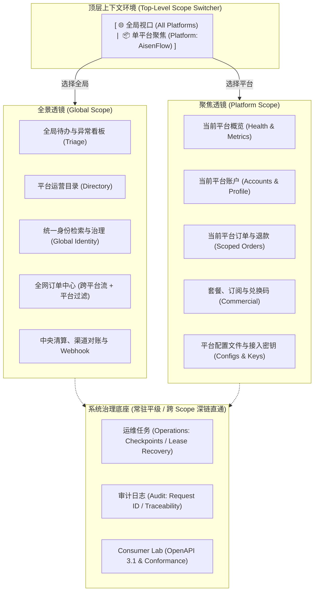
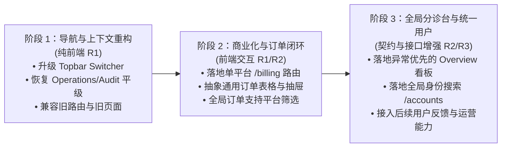

# Admin 平台中心化与双轨透镜信息架构设计

状态：Proposed

文档性质：后续优化目标架构；尚未实施。本文件冻结信息架构、职责边界、双轨透镜模型（Dual-Scope Lens Model）与平滑迁移原则，不代表当前代码已经具备目标页面或所有数据聚合能力，也不在当前阶段引入破坏性变更。

关联：[当前 Admin 架构](../../architecture/modules/frontends.md) · [系统概览](../../architecture/overview.md) · [ADR-0001 自营平台统一账户与安全边界](../../decisions/0001-platform-account-boundaries.md) · [Admin 2.0 导航与桌面工作区](../admin-2-navigation-ia/design.md) · [Admin 操作体验改进](../admin-ux-review/design.md) · [Admin 设计系统](../../../apps/admin/DESIGN.md)

---

## 1. 背景与核心问题剖析

Admin 在经历 Admin 2.0 升级后，已成功确立了 Global Admin 与 Platform Workspace 两种上下文，并引入了 URL 驱动的 `platformId` 隔离机制和 Inspector 桌面交互流。然而，在探索“以平台为中心（Platform-Centric）”的演进过程中，早期草案曾试图走向一种极端的“目录式层级化”（即：全局只有概览与目录，所有具体业务强行下沉到单个平台，并将运维与审计降维为设置）。

这种自顶向下的静态目录模型在面对真实的管理员工作流时，会产生严重的**“全平台与平台管理关系别扭”**，其根本原因在于以下六大架构缺陷：

### 1.1 “非全即单”的两极化，割裂了事件驱动的管理工作流
管理员的日常工作不是“按租户逐个查房”，而是**“事件与异常驱动（Event/Triage-driven）”**。
* 当系统出现“待处理退款申请”或“支付未决告警”时，管理员在全局若只能看到一个抽象数字，就必须被迫执行痛苦的跳步操作：*回到平台目录 -> 选择 Platform A -> 处理 2 笔 -> 退回目录 -> 选择 Platform B -> 处理 3 笔*。
* 跨平台客诉（例如用户报送邮箱 `user@example.com` 出现登录或权益异常）发生时，管理员预先并不知道（也不应先猜）该用户属于哪个平台。缺少全局工作视口会导致跨平台排障链路被物理截断。

### 1.2 抹杀了“全局身份（Identity）”与“平台账户（Account）”的领域张力
根据 [ADR-0001](../../decisions/0001-platform-account-boundaries.md) 的核心架构设计：
* **用户的 Identity 是全局共享的**（Supabase Auth，全局统一登录与凭据）；
* **用户的 Account 是平台隔离的**（`platform_accounts`，按 `platform_id` 隔离资料、偏好与权益）。
如果全局层面完全剔除用户入口，当面临全局身份冻结、多平台账户关联排查、跨服务删除（Global Delete Checkpoint 任务）时，管理员在全局视角就会陷入盲区。

### 1.3 严重的认知品类错配：把生产恢复与审计工具矮化为“设置”
将 `Operations`（后台删除任务、checkpoint、fence 租约接管、死信重试）和 `Audit`（安全追溯、Request ID 审计）塞入“设置与工具（Settings）”是重大的分类错误：
* **“设置（Settings）”**承载的是静态配置与个人偏好；
* **“运维与审计（Operations & Audit）”**是系统的**核心运行态观测、应急恢复控制台与合规追溯链路**。
在发生任务阻塞或安全告警时，迫使管理员点进“设置”寻找恢复入口，不仅违背直觉，更会放大生产故障的处理延迟。

### 1.4 模式硬切换（Mode Whiplash）导致的迷航感
若全局侧边栏极度收敛为只有“概览、平台、设置”，而一旦点击进入平台，整个侧边栏瞬间完全变样且仅留一个 `← 所有平台` 按钮，会导致强烈的迷航感。管理员在单平台操作时若需临时查看系统任务或审计，不得不先中断当前工作流、退回全局、再深入查找，路径冗长且易打断心流。

### 1.5 Billing 拆分脱离系统实际，割裂排障链路
在 AisenHub 的当前架构中（参见 `BILL-04 ~ BILL-06`），订单异常往往与 Provider Webhook 延迟、双游标对账（Reconciliation）、结算状态密切关联。若将订单处理硬性隔离在单平台，而将结算通道置于全局且不提供互通视图，管理员排查订单故障时就必须在两个上下文间反复横跳。

### 1.6 全局大盘开出“脱离数据库现状的空头支票”
若在全局概览盲目规划全网实时用户总数、今日增长、实时综合营收等重度统计，会直接违背系统“无假指标、无未授权 N+1 全表扫描”的底线。全局层必须立足于现有或易于实现的聚合边界，优先以**待办（Actionable Triage）**为主。

---

## 2. 核心架构解法：“双轨透镜模型（Dual-Scope Lens Model）”

解决上述矛盾的核心，是**彻底摒弃“父文件夹与子文件夹”的静态包含思维，转为“全景透镜（Global Scope）”与“聚焦透镜（Platform Scope）”的双轨协同架构**。



### 2.1 架构核心法则

1. **统一上下文切换器（Top-Level Context Switcher）**：
   在顶栏或侧边栏头部提供常驻且清晰的上下文选择器。管理员可以随时从下拉菜单直接切换至指定子平台，或一键回到“全局视口”，无需依赖层层后退按钮。
2. **列表组件同构（Unified Data View with Scope Filtering）**：
   全局列表与平台列表并非两套独立代码。例如订单列表：
   * 在全局透镜下，展示**全网订单流**，每行标明平台 Badge，支持多平台组合过滤；
   * 在单平台透镜下，直接**锁定当前 `platform_id`**，聚焦处理该平台业务；
   * 两者复用完全相同的表格列定义、状态徽标、Timeline 和右侧 Inspector 详情抽屉。
3. **清晰的四大职能域划分**：
   * **业务运营（Workspace）**：随 Scope 切换（全局平台目录/统一用户 vs 平台账户/用户反馈）；
   * **商业中心（Commerce）**：随 Scope 切换（中央对账与全网订单流 vs 平台专属订单/套餐/订阅/兑换码）；
   * **系统治理（System & Governance）**：**常驻且平级**（Operations 运维任务、Audit 审计日志、Consumer Lab 契约），跨上下文保持一键可达；
   * **安全设置（Settings & Security）**：严格收敛为管理员个人会话、MFA 与系统级静态策略。

---

## 3. 全新信息架构规范

### 3.1 全局视口（Global Scope：所有平台）

当上下文选择器处于 `[ 🌐 所有平台 ]` 时，侧边栏组织如下：

```text
Aisenhub
[ 🌐 所有平台 ▾ ]             <-- 顶层上下文选择器

工作台
  ├── 概览            /admin               (异常优先、聚合待办、跨平台快捷入口)
  ├── 平台目录        /admin/platforms     (平台健康、活跃度、进入单平台工作区)
  └── 统一用户        /admin/accounts      (跨平台身份检索、Supabase Auth 状态治理)

商业中心
  ├── 订单中心        /admin/billing/orders (所有平台订单流，支持按平台/渠道过滤)
  └── 清算与渠道      /admin/billing/settlement (Provider 状态、双游标对账、Inbox 任务)

系统治理
  ├── 运维任务        /admin/operations    (删除任务、checkpoint、fence、可控重试)
  ├── 审计记录        /admin/audit         (全平台敏感操作追溯、Request ID 溯源)
  └── Consumer Lab   /admin/consumer-lab  (公共 HTTP 契约与 Harness 边界)

设置
  └── 安全与账户      /admin/security      (Admin MFA、Session、recent-auth 状态)
```

### 3.2 平台视口（Platform Scope：单平台工作区）

当上下文选择器选中具体平台（例如 `[ 📦 AisenFlow ]`）时，侧边栏平滑收敛为该平台的专用工作区：

```text
Aisenhub
[ 📦 AisenFlow ▾ ]          <-- 点击可快速切换至其他平台或返回“所有平台”

平台运营
  ├── 平台概览        /admin/platforms/:id           (单平台健康、关键指标、待办)
  ├── 平台账户        /admin/platforms/:id/accounts  (平台账户、用户资料、本地封停)
  └── 用户反馈 (规划) /admin/platforms/:id/feedback

商业化
  ├── 订单与计费      /admin/platforms/:id/billing   (当前平台订单、退款、Timeline)
  ├── 套餐管理        /admin/platforms/:id/plans     (平台 Plan 定价与默认策略)
  ├── 订阅管理        /admin/platforms/:id/subscriptions (账户订阅投影查看与同步)
  └── 兑换码          /admin/platforms/:id/redemption-batches (兑换批次与券码导出)

资源与接入
  ├── 配置文件        /admin/platforms/:id/files     (私有 Storage 配置文件管理)
  ├── 接入地址        /admin/platforms/:id/settings/origins (浏览器 Origin allowlist)
  └── 接入密钥        /admin/platforms/:id/settings/keys    (服务端 Platform Key 管理)

平台设置
  └── 基本设置        /admin/platforms/:id/settings  (平台元数据、激活开关、状态停用)
```

*在平台视口下，侧边栏底部或 Topbar 保留系统治理的快捷跳转直通链接，确保在单平台排查问题时，无需退出即可快速定位关联的运维任务与审计日志。*

---

## 4. 关键模块职责与行为设计

### 4.1 Global Overview：异常与待办优先（Triage-First）

首页严守**“只展示权威数据、拒绝伪造大盘”**的原则，定义为系统的**中央分诊台（Triage Center）**：

```text
┌────────────────────────────────────────────────────────────┐
│ 所有平台概览                                                │
├──────────────────────────────┬─────────────────────────────┤
│ 平台健康状态                 │ 待处理业务待办              │
│ 12 个平台: 10 正常 · 1 警告  │ • 待审核/异常订单: 3 笔     │
│ [查看平台目录 →]             │ • 待处理用户反馈: 12 条     │
├──────────────────────────────┼─────────────────────────────┤
│ 系统运行与恢复               │ 最近敏感审计活动            │
│ • 后台删除任务: 1 项需重试   │ • Key 轮转 (admin@aisenhub) │
│ • Webhook Inbox: 正常        │ • 账户封禁 (platform_flow)  │
│ [进入运维任务 →]             │ [查看全部审计 →]            │
└──────────────────────────────┴─────────────────────────────┘
```

* **指标表达规则**：
  1. **有界读取诚实表达**：若当前 API 仅拉取前 50 条异常，展示 `≥50` 或明确标注“最近窗口”，不假装是全库精准统计。
  2. **失败明确呈现**：接口异常或未配置时显示 `—` 或告警徽标，绝不以绿色 `0` 伪装健康。
  3. **一键穿透深入（Drill-Down）**：点击任何异常项，直接带过滤参数跳转到对应平台的具体对象（如点击平台 A 的订单异常，直接打开 `Platform A / 订单与计费` 并激活该订单 Inspector）。

### 4.2 统一用户 vs 平台账户（Identity vs Account）

* **全局“统一用户（/admin/accounts）”**：
  * **视角**：全局 Supabase Auth 身份。
  * **能力**：按邮箱、Auth UID 全局搜索用户；查看该用户在各个子平台关联的账户列表；执行全局身份级的强制登出、安全锁定或 Global Delete 发起。
* **平台内“平台账户（/admin/platforms/:id/accounts）”**：
  * **视角**：单一平台账户（`platform_accounts`）。
  * **能力**：查看并管理该平台内的特定资料、账户状态（active/suspended/closed）、平台专属文件配额、订阅投影与该平台内的审计记录。

### 4.3 商业化：全网订单流与单平台订单协同

* **跨平台订单中心（/admin/billing/orders）**：
  承载全网实时订单流水。表头包含 `平台` 标签列，提供 `平台（可多选）`、`支付状态`、`Provider` 筛选器。适用于财务审计、多平台联动退款、批量未确认订单清理。
* **平台订单与计费（/admin/platforms/:id/billing）**：
  锁定当前平台上下文，专注于该平台的日常商业运营。查看订单生命周期 Timeline、发起订单退款、执行人工确认（Manual Review），并直观关联到该平台的套餐（Plans）与订阅（Subscriptions）。
* **技术实现**：
  两者复用同一个底层 `OrderWorkspaceTable` 组件，通过 props 控制是否显示 `PlatformColumn` 以及是否自动锁定 `platformId`，杜绝重复开发与行为不一致。

### 4.4 系统治理（Operations & Audit）：独立平级与就近直通

* **运维任务（Operations）**：
  集中监控与调度后台关键任务（核心是账户删除与资源清理任务）：
  * 状态、Checkpoint 游标、重试次数、最后一次错误码；
  * Fencing token 校验与租约过期接管；
  * Blocked 任务的安全人工重试；
  * 提供直接跳转至该操作关联 Request ID 审计日志的深链。
* **审计记录（Audit）**：
  系统的只读安全账簿：
  * 记录操作人、来源 IP、目标资源类型、目标 ID、操作动作、结果状态（成功/失败/未确认）与 Request ID；
  * 业务页面在涉及关键变更时，均提供 `查看关联审计日志` 的深链接，实现**“工具不占日常导航焦点，但排查链路触手可及”**。

---

## 5. 交互规范与桌面体验基线

### 5.1 上下文切换器交互（Context Switcher UX）
* **位置**：Sidebar Header 品牌区下方，或 Topbar 左侧。
* **展开状态**：
  * 顶部为固定项：`🌐 所有平台（全局视口）`；
  * 下方为搜索输入框（输入拼音/英文快速过滤平台）；
  * 平台列表展示：平台图标、名称、状态小圆点（绿色正常 / 黄色警告 / 灰色停用）；
  * 底部提供快捷操作：`+ 创建新平台`（需对应管理员权限）。
* **切换行为**：
  * 点击某个平台，路由平滑跳转至该平台的同等或概览路由（如从全局订单跳至单平台订单）；
  * URL 中的 `platformId` 是平台上下文的唯一真理来源（Single Source of Truth），上下文切换器仅作为直观的导航控制器，不引入脆弱的客户端隐式状态。

### 5.2 对象工作区与 Inspector 标准流
所有资源页面统一遵循四段式工作区标准：
```text
┌────────────────────────────────────────────────────────┐
│ Workspace Header: 标题、当前上下文说明、主操作按钮     │
├────────────────────────────────────────────────────────┤
│ Resource Toolbar: 搜索、状态筛选、视图切换、批量操作    │
├──────────────────────────────────┬─────────────────────┤
│ Resource Table / Grid:           │ Resource Inspector: │
│ 数据主列表                       │ 选定项右侧抽屉      │
│ • 支持键盘上下键切换选择         │ • 详细元数据        │
│ • 单一横向滚动容器承担宽表格     │ • 关键状态时间线    │
│ • 第一列突出核心名称，技术 ID 降级 │ • 就近敏感操作按钮  │
└──────────────────────────────────┴─────────────────────┘
```
选定项自动同步至 URL 参数（如 `?selected=acc_123`），确保刷新、后退与复制链接具备确定性行为。

---

## 6. 路由映射与平滑兼容策略

所有现有路由保持 100% 向后兼容，新增与调整后的路由规划如下：

```text
# 全局透镜 (Global Scope)
/admin                                      # 全局概览 (异常待办看板)
/admin/platforms                            # 平台目录 (全部平台健康与管理)
/admin/accounts                             # 统一用户 (跨平台身份检索)
/admin/billing/orders                       # 全网订单流 (原 /admin/billing 的核心流)
/admin/billing/settlement                   # 中央清算、Provider 与对账
/admin/operations                           # 运维任务 (保持兼容，不降级为设置)
/admin/audit                                # 审计记录 (保持兼容，不降级为设置)
/admin/consumer-lab                         # Consumer Lab (保持兼容)
/admin/security                             # 管理员安全与 MFA (保持兼容)

# 平台透镜 (Platform Scope)
/admin/platforms/:platformId                # 平台概览
/admin/platforms/:platformId/accounts       # 平台账户管理
/admin/platforms/:platformId/billing        # 平台订单与计费 (新增，复用订单工作区)
/admin/platforms/:platformId/plans          # 平台套餐配置
/admin/platforms/:platformId/subscriptions  # 平台订阅管理
/admin/platforms/:platformId/redemption-batches # 平台兑换码管理
/admin/platforms/:platformId/files          # 平台配置文件
/admin/platforms/:platformId/settings       # 平台基本配置
/admin/platforms/:platformId/settings/origins # 平台 Origin 白名单
/admin/platforms/:platformId/settings/keys  # 平台 Platform Keys
```

*迁移策略：第一阶段完全保留现有 `/admin/billing` 访问入口，并在其顶部增加 Tab 或直接重构为支持平台筛选的订单中心；第二阶段在平台工作区新增 `/billing` 路由并注入 `platformId` 预筛，逐步实现平滑过渡。*

---

## 7. 架构约束与不可妥协的底线

后续任何实施阶段必须严守以下安全与系统底线：

1. **URL 是唯一的平台上下文真理来源**：
   平台工作区必须严格绑定 URL 中的 `platformId`。前端组件禁止使用全局状态存储 `currentPlatformId` 作为敏感请求的鉴权参数。
2. **同源 BFF 边界不可逾越**：
   浏览器端仅通过同源 `/api/v1/...` 调用后端能力，严禁在前端直连数据库、调用外部 Storage 裸链接或分发服务端 Platform Secret。
3. **敏感操作安全阶梯不可降级**：
   无论在全局还是单平台，敏感操作（账户强制封停、密钥轮转、删除任务重试、退款执行）必须严格依赖服务端校验近期 MFA（Step-up proof 5 分钟窗口）。UI 上的按钮状态仅做引导，不构成权限防护。
4. **诚实呈现系统状态**：
   数据源失败、超时或权限不足时，必须明确反馈错误状态，严禁将未确认状态渲染为正常或“零数据”。未知结果（Unknown Outcome）必须保留恢复屏障。
5. **不随意扩张 Global Sidebar**：
   未来新增的业务功能（如用户反馈、AI 用量、工单、Push 通知），凡能明确归属单平台的，必须优先落地至单平台工作区；全局层仅开放聚合告警或统一检索，杜绝侧边栏无序膨胀。

---

## 8. 分阶段落地路线图

建议后续按照风险可控、收益显著的节奏推进重构：



* **阶段 1（即刻可行，纯前端 R1 级）**：
  重构 `apps/admin/components/navigation/admin-navigation.ts` 与 `admin-sidebar.tsx`。引入统一上下文选择器概念，纠正“设置与工具”杂烩，将系统治理恢复为常驻分组，保持所有底层页面功能完全不变。
* **阶段 2（高业务价值，前端组件复用）**：
  新增 `/admin/platforms/[platformId]/billing` 页面，将中央 Billing 现有的订单列表与详情逻辑抽象为可复用组件，实现单平台内的商业化闭环。
* **阶段 3（全局能力完善，契约与后端协同）**：
  基于现有 API 汇总能力，升级全局首页为异常分诊看板；定义跨平台身份检索接口规范，打通从全局到各子平台的深链穿透体系。
