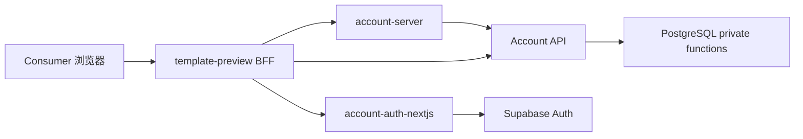
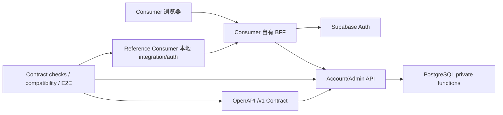

# 移除 Consumer SDK 与 Contract-First 接入架构设计

状态：In Progress

关联：[总计划](plan.md)

## 背景与当前问题

AisenHubPlatform 当前同时维护中央 HTTP API、OpenAPI、共享 DTO、三个 Consumer SDK/适配包、SDK tarball/manifest、Registry SDK 兼容信息和独立安装探针。当前主要 Consumer 运行依赖为 `@kit/account-auth`、`@kit/account-auth-nextjs`、`@kit/account-server`，参考应用还直接依赖 `@kit/domain`。这让公共协议存在多份表达，新增或调整一个接口时容易同时触碰 OpenAPI、DTO、SDK 方法、打包、安装和文档。

现有代码也证明 SDK 并非纯便捷包装：`packages/account-server` 固化 Platform Key、Bearer、幂等、ETag、超时/重试和 fail-closed 权益授权；`packages/account-auth-nextjs` 固化 Cookie、CSRF、刷新、退出 fence、session acknowledgement、recent auth 和浏览器重放策略。因此本优化不能先删除包再让各 Consumer 临时重写，而必须先把稳定性来源迁移到 HTTP 合同、Reference Consumer、本地集成代码和自动合同检查。

当前已有可复用基础：

- `docs/reference/contracts/account.openapi.json`、`admin.openapi.json` 已是 OpenAPI 3.1.0。
- `tooling/scripts/src/openapi-check.mjs` 已验证 `$ref`、operationId、安全声明、错误码、二进制和 no-store。
- `tooling/scripts/src/contract-consumer-check.mjs` 与 `contract-consumers.json` 已维护 producer/edge/consumer/test owner 映射。
- `contract-consumer-matrix.md` 已冻结 expand-first 兼容原则。
- `apps/template-preview` 已经是真实 Browser → BFF → Account API 的可运行参考路径，且 BFF 已直接通过标准 `fetch` 代理大部分 Account API。

本任务按开发发布流程属于 R3：会改变 Auth/BFF、公共合同、依赖、构建和测试门槛，但不修改数据库 schema、领域状态机或生产数据。

## 目标与范围

目标是完全取消 **面向 Consumer 的 AisenHub Runtime SDK 体系**，把公共集成边界收敛为标准 HTTP + OpenAPI，并保持当前安全和业务语义不退化。

完成后必须满足：

1. 不再存在 `packages/account-auth`、`packages/account-auth-nextjs`、`packages/account-server`。
2. 不再生成 SDK tarball、SDK manifest，也不存在 `sdk:pack`、SDK 安装测试或 Registry SDK compatibility。
3. `packages/domain` 保留为中央内部 Domain 包，但 Reference Consumer 不再导入它；外部 Consumer 不把它视为公共 API。
4. Account/Admin OpenAPI 提升到根 `contracts/`，成为唯一机器可读公共 wire contract。
5. `/v1` 定义为 backward-compatible wire boundary；破坏性变更必须重新设计或进入 `/v2`。
6. `apps/template-preview` 作为 Reference Consumer，不再依赖 `@kit/account-*` 或 `@kit/domain`，通过本地拥有的 integration/auth 代码接入。
7. Admin 作为中央应用也不再依赖 Auth SDK；它可以继续依赖 `@kit/domain` 的中央内部能力。
8. 合同兼容性、Reference Consumer 和现有真实 HTTP/E2E 验证替代 SDK 打包/安装作为主要稳定性门槛。

## 非目标

本 Proposal 不：

- 重写 PostgreSQL 领域函数、Billing、Entitlement、兑换、文件状态机或 Provider 协议。
- 将现有 Supabase Auth 在本轮改造成 OAuth/OIDC Provider；标准 OIDC 化可另立 Proposal。
- 移除 `@kit/ui`、`@kit/shared` 等 monorepo UI/展示依赖；“无 SDK”只要求集成边界不依赖 `account-*` 和 `domain`。
- 引入 GraphQL、API Gateway、微服务、Pact Broker 或公共开发者门户。
- 为了“无 SDK”放宽 Origin、CSRF、MFA、Platform Key、资源归属、RLS、no-store 或 fail-closed 规则。

## 当前架构



Admin 同样依赖 `account-auth-nextjs`。根 build/typecheck 会先运行 `sdk:pack`，Registry 记录四个 tarball 的兼容范围，Consumer 独立安装探针验证这些 tarball。

## 目标架构



公共接口只有 HTTP method/path/status/header/body、OpenAPI schema/security、稳定错误码与 `request_id`、幂等/ETag/超时/缓存/重试语义以及服务端授权规则。`packages/domain`、SQL context、Deno adapter、Admin helper、Storage/Provider adapter 均为内部实现。

## OpenAPI 与版本规则

Canonical 合同迁移为：

```text
contracts/
├── manifest.json
├── account/v1/
│   ├── openapi.json
│   ├── COMPATIBILITY.md
│   └── CHANGELOG.md
└── admin/v1/
    ├── openapi.json
    ├── COMPATIBILITY.md
    └── CHANGELOG.md
```

第一阶段继续以 JSON 为唯一人工维护格式，不同时手工维护 YAML/JSON 两份来源。`info.version` 记录合同修订；路径 major 才定义 wire major。`/v1` 内允许兼容扩展：新 endpoint、新 optional input、新 response field；禁止直接删除/改名公共字段、改变既有字段类型/语义、增加既有请求必须提供的 required 参数、收紧安全要求而不迁移旧 Consumer。需要无法兼容的变化时建立 `/v2`。

采用 expand → migrate → contract。`/v1` 默认只做 expand/migrate，不执行破坏性的 contract 删除。

## Consumer 所有权

每个 Consumer 自己拥有 integration adapter，例如：

```text
src/integrations/aisenhub/
├── http.ts
├── account.ts
├── auth.ts
├── errors.ts
└── generated-types.ts
```

AisenHubPlatform 可以提供 Reference Consumer 的完整源码供复制，但复制后的代码属于 Consumer，不形成 npm/workspace runtime dependency。中央只保证 wire contract，不保证某个 OpenAPI generator 的源码 API。

Reference Consumer 的可执行约束是：`apps/template-preview/package.json` 不能依赖 `@kit/account-*` 或 `@kit/domain`，源码也不能导入这些包。它仍可复用 `@kit/ui` 展示依赖，因为该依赖不属于中央 API 集成合同。

## Auth 去 SDK 化

本轮保持当前 Supabase Auth、Cookie 名称、刷新/退出/recent-auth 语义不变，只改变代码所有权。Reference Consumer 与 Admin 各自维护 app-local auth module，保留：

- HttpOnly access/refresh cookie 与非 HttpOnly CSRF cookie。
- logout fence、login acknowledgement、auth flow fence。
- request-scoped Supabase client，禁止共享持久 session。
- refresh single-flight、401 恢复、mutation 不盲重放。
- safe returnTo、same-origin/CSRF、recent-auth、MFA step-up。
- upstream logout 的明确 confirmed/unavailable 区分。

不新建 `@aisenhub/auth-core` 等变相公共 SDK。长期标准 OIDC 化单独评估。

## Account API 去 SDK 化

| 当前职责 | 目标归属 |
| --- | --- |
| endpoint wrapper | Consumer 本地 integration/BFF |
| Platform Key/Bearer/headers | OpenAPI + Integration Guide + Reference Consumer |
| timeout/retry | HTTP integration semantics |
| stable error/request_id | OpenAPI/HTTP contract |
| Idempotency/If-Match | OpenAPI/HTTP contract |
| `authorizeProtectedFeature` | Reference Consumer 本地 fail-closed helper/route |
| key/redemption 生成辅助 | 中央内部 Domain/Admin；不得暴露给 Consumer |

Reference Consumer 的 protected route 必须继续只使用中央 `/v1/subscription` 结果：`effective_status !== active` 拒绝；feature 仅严格 `true` 放行；任何上游异常 fail closed。

## HTTP 可靠性语义

删除 SDK 后，原本隐含在客户端里的规则进入 `docs/guides/http-integration-semantics.md`：

- GET 可在总预算内有限重试网络错误/502/503/504。
- mutation 默认不自动重试；只有同一 Idempotency-Key 且请求体可安全重放时允许有限重试。
- 二进制上传绝不自动重传；失败后先查询服务器状态。
- 400/401/403/409/412/428 不作为 transport retry。
- 429 按 `Retry-After` 和具体操作语义处理。
- 当前普通 Account 调用默认总预算 5 秒；BFF/业务授权保持已有更严格预算时以本地实现为准。

## Registry

Registry 保留模板元数据，但删除 `sdk_compatibility`，改为记录 Reference Consumer 已验收的 HTTP contract。Registry 不再负责 SDK 分发。

## 合同自动化

本轮先实现仓库内、固定行为的检查器，不把安装新的全局工具作为迁移前置：

- `contracts:check`：现有项目特定 OpenAPI/consumer invariants，移除固定 operation 数量限制。
- `contracts:breaking`：比较指定 base ref 与工作树合同，阻止明显破坏性变化，包括 operation/schema/property/type/enum 删除、required input 收紧和 security 改变等。
- Registry/Reference Consumer 静态 probe：阻止 SDK 依赖重新进入。
- 现有 Account API、BFF、浏览器 E2E 继续证明真实 HTTP 行为。

后续可独立评估 oasdiff、Spectral、Schemathesis，但本 Proposal 不以新增这些外部工具为完成前提。

## 接口、数据与配置

本任务不改变 Account/Admin wire schema、不新增数据库迁移、不改变现有环境变量名称。OpenAPI 文件只移动 canonical 路径和增加治理文档；相同 `/v1` 行为必须保持。

配置继续使用 `ACCOUNT_API_URL`、`ACCOUNT_API_TIMEOUT_MS`、`ACCOUNT_PLATFORM_KEY`、Supabase URL/Publishable Key 和精确 Origin。Platform Key 仅服务端可见，不进入 Browser、URL、日志或客户端持久存储。

## 安全不变量

1. Browser 不直接持有 Platform Key，也不直连中央 SQL/私有 Storage。
2. 用户身份来自受控 session，不信任 body 中的 `user_id`/`platform_id`/plan flag。
3. 写请求保持 Origin/CSRF；Auth/MFA/recent-auth 不因代码本地化而降级。
4. 中央授权不可用时 fail closed。
5. Consumer 不本地计算 entitlement 到期，也不复制价格、期限、配额、兑换、结算领域算法。
6. binary upload 保持有界读取和并发 gate；不自动重传。
7. no-store、request_id、跨租户 404 等合同保持。

## 风险与取舍

- Auth 复制漂移：迁移现有测试并保留相同算法；长期 OIDC 化另立 Proposal。
- Consumer 重复 HTTP 代码：这是有意的所有权变化，协议/示例/合同测试承担稳定性。
- OpenAPI 与实现漂移：保留静态检查、BFF allowlist 对齐、真实 API/E2E。
- OpenAPI 路径移动：Phase 01 一次更新脚本、测试、文档和 manifest，不保留第二份合同。
- 删除过早：严格按“先 Contract、再迁 Consumer/Auth、最后删包”的顺序实施。

## 验收条件

- active 运行代码找不到 `@kit/account-auth`、`@kit/account-auth-nextjs`、`@kit/account-server`；Reference Consumer 也找不到 `@kit/domain`。
- 三个 SDK/适配 package 和 SDK 打包/安装脚本删除。
- root build/typecheck 不再执行 SDK pack。
- canonical contracts 位于根 `contracts/`，所有 active 引用和检查器同步。
- Reference Consumer 与 Admin typecheck/build/unit 通过；Auth/BFF 安全负例继续通过。
- `contracts:check`、`contracts:breaking`、Registry/Reference Consumer probe 通过。
- 适用本地 Supabase、Account API 和 Consumer/Admin E2E 按 R3 实际执行并记录。
- architecture/reference/guides 已描述实际无 SDK 架构。

## 待确认项

当前设计没有阻塞实施的业务待确认项。未来 OIDC、第三方 OpenAPI lint/diff/fuzz 工具均可另立任务。
